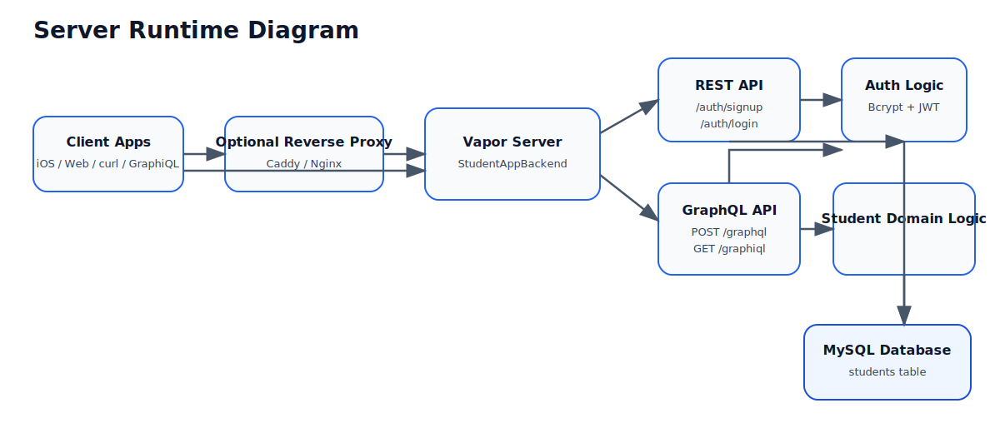
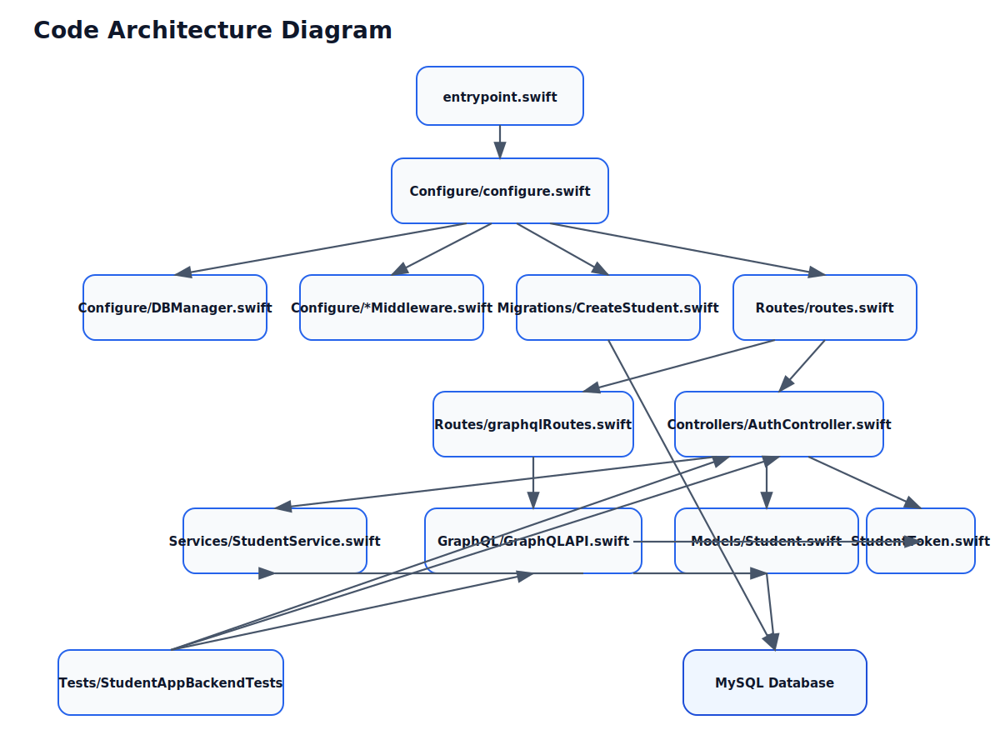

# StudentAppBackend — Linux / macOS Setup Guide

Vapor-based Swift backend that exposes student authentication APIs over REST and additional student APIs over GraphQL. This guide covers **native local development** on Linux and macOS, with optional Docker-based workflows.

---

## Overview

- **Framework:** Vapor 4
- **Language:** Swift 6
- **Database:** MySQL
- **API styles:** REST and GraphQL
- **Container registry:** GitHub Container Registry (GHCR)

## Features

- Student signup, login, and logout over REST
- GraphQL endpoint for student queries and mutations
- JWT-based authentication with token revocation on logout
- Centralized validation across REST and GraphQL
- Docker-based local development (optional)
- Optional HTTPS support for native local runs
- Optional reverse-proxy TLS termination with Caddy

## Server Diagram

[](docs/diagrams/server-runtime.puml)

PlantUML source: [server-runtime.puml](docs/diagrams/server-runtime.puml)

This diagram shows the runtime flow between clients, the Vapor server, REST routes, GraphQL routes, authentication logic, and MySQL.

## Project Structure

- [`Sources/StudentAppBackend`](Sources/StudentAppBackend): application source
- [`Tests/StudentAppBackendTests`](Tests/StudentAppBackendTests): test suite
- [`docker-compose.yml`](docker-compose.yml): local source-based development
- [`docker-compose.package.yml`](docker-compose.package.yml): packaged backend + MySQL
- [`docker-compose.caddy.yml`](docker-compose.caddy.yml): backend behind Caddy with HTTPS termination

## Code Architecture

[](docs/diagrams/code-architecture.puml)

PlantUML source: [code-architecture.puml](docs/diagrams/code-architecture.puml)

This diagram shows how `configure.swift`, routes, controllers, GraphQL, services, models, migrations, middleware, and tests fit together in the codebase.

---

## Requirements

- macOS 13 or later (or a modern Linux distribution)
- Swift 6 toolchain / Xcode compatible with the package
- MySQL 8 if running outside Docker
- Docker and Docker Compose for container-based setup (optional)

---

## Local Development

### Build

```bash
swift build
```

### Run

```bash
swift run
```

### Test

```bash
swift test
```

Current tests cover the REST auth flow, logout authorization behavior, logout token reuse rejection, GraphQL signup, and validation edge cases.

---

## Docker (Optional)

### Published Image

The backend container is published to GitHub Container Registry through the consolidated CI/CD workflow at `.github/workflows/swift.yml`.

- Default image: `ghcr.io/rajeshm20/studentappbackend:latest`
- Additional tags: `main`, release tags such as `v1.0.0`, and commit SHA tags

To publish from CI:

```bash
git push origin main
```

To publish a versioned image:

```bash
git tag v1.0.0
git push origin v1.0.0
```

The Docker publish job runs only after the test job passes.

### Complete Packaged Setup

The published image contains only the backend application. To run the backend together with MySQL, use [`docker-compose.package.yml`](docker-compose.package.yml):

```bash
docker compose -f docker-compose.package.yml up -d
```

This package starts:

- `ghcr.io/rajeshm20/studentappbackend:latest`
- `mysql:8`

Default database-related values:

- `DATABASE_USER=root`
- `DATABASE_PASSWORD=newpassword`
- `MYSQL_ROOT_PASSWORD=newpassword`
- `MYSQL_ROOT_HOST=%`

For local development from source, use [`docker-compose.yml`](docker-compose.yml). It provides the same runtime shape but builds the backend image from this repository.

If MySQL was previously started with older credentials or host permissions, recreate the volume once:

```bash
docker compose -f docker-compose.package.yml down -v
docker compose -f docker-compose.package.yml up -d
```

---

## API Endpoints

### REST

Base URL for the packaged Docker setup:

```text
http://localhost:8080
```

#### Signup

```bash
curl -X POST http://localhost:8080/auth/signup \
  -H "Content-Type: application/json" \
  -d '{
    "name": "SasvathRN",
    "email": "sasvathrn@rnss.com",
    "password": "password123"
  }'
```

#### Login

```bash
curl -X POST http://localhost:8080/auth/login \
  -H "Content-Type: application/json" \
  -d '{
    "email": "rajesh@example.com",
    "password": "password123"
  }'
```

The login response includes a JWT token that you pass to protected flows such as logout.

#### Logout

```bash
curl -X POST http://localhost:8080/auth/logout \
  -H "Authorization: Bearer YOUR_JWT_TOKEN"
```

Expected success response:

```json
{
  "message": "Logout successful"
}
```

#### Logout behavior in the current implementation:

- Requires a bearer token in the `Authorization` header
- Verifies the JWT before processing the request
- Stores the token `jti` in the revoked-token table
- Rejects repeated logout attempts with the same token

#### Example Auth Flow with Logout

1. Sign up a user.
2. Log in and capture the returned token.
3. Call logout with that token.

Example logout after login:

```bash
curl -X POST http://localhost:8080/auth/logout \
  -H "Authorization: Bearer eyJhbGciOi..."
```
#### Forgot password with email OTP validation

forgot password (sends OTP)
```bash
curl -X POST http://localhost:8080/auth/forgot-password \
  -H "Content-Type: application/json" \
  -d '{
    "email": "your-real-email@gmail.com"
  }'
```
Expected response (success — email is registered):

```json
{
  "success": true,
  "message": "A verification code has been sent to your email."
}
```
Expected response (email not registered):

```json
{
  "success": false,
  "message": "Email not registered, please enter a registered email id."
}
```
Where to find the code:

If SENDGRID_API_KEY is set → check the actual inbox for your-real-email@gmail.com.
If it's not set (falls back to ConsoleEmailService) → check your terminal/server logs where swift run is running — you'll see something like:
  📧 [DEV EMAIL] To: your-real-email@gmail.com | Subject: Your password reset code
  Your verification code is: 482913
  
#### Verify the code
```bash
curl -X POST http://localhost:8080/auth/verify-reset-code \
  -H "Content-Type: application/json" \
  -d '{
    "email": "your-real-email@gmail.com",
    "code": "482913"
  }'
```
Expected response (success):

```json
{
  "success": true,
  "message": "Code verified.",
  "sessionToken": "aB3xY9k2mZ..."
}
```
Copy the sessionToken from this response — you need it for step 3.

Expected response (wrong/expired code):

```json
{
  "success": false,
  "message": "Invalid code.",
  "sessionToken": null
}
```
#### Reset the password
```bash
curl -X POST http://localhost:8080/auth/reset-password \
  -H "Content-Type: application/json" \
  -d '{
    "email": "your-real-email@gmail.com",
    "sessionToken": "aB3xY9k2mZ...",
    "newPassword": "NewPass123",
    "confirmPassword": "NewPass123"
  }'
```
Expected response (success):

```json
{
  "success": true,
  "message": "Password reset successfully"
}
```
Expected error responses:

```json
// mismatched passwords
{"error": true, "reason": "Passwords do not match"}
```
// too short
```json
{"error": true, "reason": "Password must be at least 8 characters"}
```
// expired/invalid/reused session token
```json
{"error": true, "reason": "Invalid or expired reset session"}
```
#### Confirm the new password actually works
```bash
curl -X POST http://localhost:8080/auth/login \
  -H "Content-Type: application/json" \
  -d '{
    "email": "your-real-email@gmail.com",
    "password": "NewPass123"
  }'
```
Should return a valid JWT if the reset actually took effect.

Quick edge-case tests worth running too

#### Unregistered email:

```bash
curl -X POST http://localhost:8080/auth/forgot-password \
  -H "Content-Type: application/json" \
  -d '{"email": "not-a-real-user@nowhere.com"}'
```
#### Reusing an already-verified code (should fail — single-use):

```bash
# Run step 2 again with the same code after step 3 already succeeded
curl -X POST http://localhost:8080/auth/verify-reset-code \
  -H "Content-Type: application/json" \
  -d '{"email": "your-real-email@gmail.com", "code": "482913"}'
```
#### Expect this to fail since used = true after a successful reset.

#### Waiting past the 10-minute code expiry, then verifying (should fail):

```bash
curl -X POST http://localhost:8080/auth/verify-reset-code \
  -H "Content-Type: application/json" \
  -d '{"email": "your-real-email@gmail.com", "code": "482913"}'
```
Expect: "Code has expired. Please request a new one."

## Current GraphQL operations:

- `students`: fetch all students
- `student(id: UUID!)`: fetch a single student
- `signup(input: StudentGraphQLCreateInput!)`: create a student
- `login(input: StudentGraphQLLoginInput!)`: authenticate and return a JWT
- `updateStudent(input: StudentGraphQLUpdateInput!)`: update `dob`, `name`, and `phoneNumber`

#### Signup Mutation

```bash
curl -X POST http://localhost:8080/graphql \
  -H "Content-Type: application/json" \
  -d '{
    "query": "mutation Signup($input: StudentGraphQLCreateInput!) { signup(input: $input) { id name email } }",
    "variables": {
      "input": {
        "name": "Graph User",
        "email": "graphql@example.com",
        "password": "password123"
      }
    }
  }'
```

#### Login Mutation

```bash
curl -X POST http://localhost:8080/graphql \
  -H "Content-Type: application/json" \
  -d '{
    "query": "mutation Login($input: StudentGraphQLLoginInput!) { login(input: $input) { token user { id name email } } }",
    "variables": {
      "input": {
        "email": "graphql@example.com",
        "password": "password123"
      }
    }
  }'
```

#### Update Student Mutation

```bash
curl -X POST http://localhost:8080/graphql \
  -H "Content-Type: application/json" \
  -d '{
    "query": "mutation UpdateStudent($input: StudentGraphQLUpdateInput!) { updateStudent(input: $input) { id name phoneNumber dob } }",
    "variables": {
      "input": {
        "id": "PUT-STUDENT-UUID-HERE",
        "name": "Updated Name",
        "phoneNumber": "+1 234 567 8900"
      }
    }
  }'
```

#### Students Query

```bash
curl -X POST http://localhost:8080/graphql \
  -H "Content-Type: application/json" \
  -d '{
    "query": "{ students { id name email phoneNumber dob } }"
  }'
```

Minimal students query:

```bash
curl -X POST http://localhost:8080/graphql \
  -H "Content-Type: application/json" \
  -d '{
    "query": "{ students { id name email } }"
  }'
```

---

## Validation Hardening

The current backend applies validation in multiple layers so invalid data is rejected before it can silently drift into persistence.

### Where Validation Runs

- REST signup uses Vapor validation plus shared `ValidationUtilities.swift` checks
- GraphQL signup reuses the same create-request validation rules
- GraphQL `updateStudent` validates `dob`, `name`, and `phoneNumber`
- MySQL schema constraints backstop key field lengths at the database level

### Current Validation Rules

#### Name

- Required for signup
- Must not be empty or whitespace-only
- Maximum length: 100 characters

#### Email

- Required for signup
- Must match email format rules
- Maximum length: 254 characters
- Still enforced as unique at the database level

#### Password

- Required for signup
- Minimum length: 8 characters
- Must contain at least one letter and one number

#### Date of Birth

- Optional
- Must not be in the future
- Must represent a plausible age between 5 and 120 years

#### Phone Number

- Optional
- Must be 10 to 20 characters
- May contain only digits, `+`, `-`, and spaces

### Database-Level Backstop

The `students` schema adds `CHECK` constraints for:

- `name` length up to 100 characters
- `email` length up to 254 characters
- `phoneNumber` length between 10 and 20 characters when present

This means malformed or oversized values are not only blocked at the API layer, but also guarded at the database layer.

### Example Invalid Signup Request

```bash
curl -X POST http://localhost:8080/auth/signup \
  -H "Content-Type: application/json" \
  -d '{
    "name": "",
    "email": "not-an-email",
    "password": "short"
  }'
```

Expected behavior:

- HTTP `400 Bad Request`
- Validation failure reason returned by the API
- No student row created

### Validation Test Coverage

The current test suite includes cases for:

- empty and oversized names
- malformed and oversized emails
- weak passwords
- future and implausible dates of birth
- malformed, too-short, and too-long phone numbers
- valid payloads with optional fields present or absent

---

## HTTPS

### Native Local HTTPS

If running the Vapor app directly and you want local HTTPS, generate a self-signed certificate with `CN=localhost`.

1. Generate the certificate and key.

```bash
openssl req -x509 -newkey rsa:2048 -nodes \
  -keyout key.pem -out cert.pem -days 365 \
  -subj "/CN=localhost"
```

2. Export a `.p12` bundle if needed.

```bash
openssl pkcs12 -export -out localhost.p12 \
  -inkey key.pem -in cert.pem \
  -name "Vapor Localhost Cert"
```

3. Import `cert.pem` into macOS Keychain and set it to trust for local use.
4. Restart the Vapor application so it reloads the certificates.
5. Test the endpoint again.

```bash
curl https://localhost:8080/auth/login \
  -H "Content-Type: application/json" \
  -d '{"email":"rajesh@example.com","password":"password123"}'
```

### HTTPS with Caddy

To run the backend behind Caddy with TLS termination, use [`docker-compose.caddy.yml`](docker-compose.caddy.yml):

```bash
docker compose -f docker-compose.caddy.yml up -d
```

This keeps the backend container on HTTP and lets Caddy manage HTTPS on port `443`.

For local Caddy testing, use:

```text
https://localhost
```

---

## MySQL Setup on macOS

If you are not using Docker, install and configure MySQL locally.

### Install

```bash
brew update
brew install mysql
```

### Start

Start MySQL as a background service:

```bash
brew services start mysql
```

Or start it manually when needed:

```bash
mysql.server start
```

### Secure the Installation

```bash
mysql_secure_installation
```

Recommended actions during setup:

- Set a root password
- Remove anonymous users
- Disallow remote root login unless explicitly required
- Remove the test database
- Reload privilege tables

### Connect

```bash
mysql -u root -p -h 127.0.0.1 -P 3306
```

---

## Deployment Notes

- In Docker or production environments, keep the app container on HTTP.
- Terminate TLS in Caddy, Nginx, or another reverse proxy.
- Do not package local self-signed certificates into production images.

---

## References

- [Vapor Website](https://vapor.codes)
- [Vapor Documentation](https://docs.vapor.codes)
- [Vapor GitHub](https://github.com/vapor)
- [Vapor Community](https://github.com/vapor-community)


# StudentAppBackend — Setup Guide Comparison

Side-by-side comparison of the **WSL + Docker** setup vs the **Linux / macOS (native)** setup.


| | **WSL + Docker Setup Guide** | **Linux / macOS Setup Guide** |
|---|---|---|
| **Target environment** | Windows 11 with WSL2 (Ubuntu), everything runs via Docker | Native Linux or macOS, with Docker optional |
| **Prerequisites** | Windows 11 + WSL2 (Ubuntu)<br>Docker installed and running<br>Git<br>Ports: MySQL `3306`, App `8081` if `8080` is taken | macOS 13+ or modern Linux<br>Swift 6 toolchain / Xcode<br>MySQL 8 (if not using Docker)<br>Docker + Compose (optional) |
| **Clone repo** | `git clone https://github.com/rajeshm20/StudentAppBackend.git`<br>`cd StudentAppBackend`<br>`ls` (expect `Dockerfile`, `Package.swift`, `Sources/`) | Same clone step, but typically followed by native build rather than Docker build |
| **Build the app** | `docker buildx create --use --name mybuilder`<br>`docker buildx inspect --bootstrap`<br>`docker buildx build --platform linux/amd64 -t studentappbackend:local --load .` | `swift build` |
| **Run the app** | `docker run -p 8081:8080 studentappbackend:local` | `swift run` |
| **Run tests** | Handled inside CI container (`swift test -v`); current coverage includes signup, login, logout, and logout token-reuse cases | `swift test`; current coverage includes signup, login, logout, and logout token-reuse cases |
| **Database setup** | `docker compose up -d db` (MySQL runs in a container)<br>Verify: `docker ps` | Docker Compose **or** native Homebrew MySQL:<br>`brew install mysql`<br>`brew services start mysql`<br>`mysql_secure_installation` |
| **Common issues** | **ARM64 image on AMD64** → `exec format error`, fix with `--platform linux/amd64` rebuild<br>**Port in use** → `sudo ss -tulpn \| grep :8080`, remap with `-p 8081:8080`<br>**MySQL refused** → check `docker ps`, or `docker compose up -d` | Not covered — native builds don't hit the ARM64/AMD64 container mismatch; port conflicts are OS-level (`lsof -i :8080` on macOS/Linux) |
| **Git branch workflow** | `git checkout -b wsl_studentappbackend`<br>`git add .`<br>`git commit -m "..."`<br>`git push -u origin wsl_studentappbackend` | Not specific to platform — standard feature-branch workflow applies |
| **Publish to GHCR (manual)** | `docker tag studentappbackend:local ghcr.io/rajeshm20/studentappbackend:wsl-v1`<br>`docker login ghcr.io -u rajeshm20`<br>`docker push ghcr.io/rajeshm20/studentappbackend:wsl-v1` | Same manual tag/login/push steps apply if building locally on macOS/Linux |
| **Publish via CI** | `git push origin main` (latest)<br>`git tag v1.0.0 && git push origin v1.0.0` (versioned) | Identical — CI publishing is platform-agnostic |
| **Packaged setup (app + DB)** | `docker compose -f docker-compose.package.yml up -d` | Same command, same defaults (`DATABASE_USER=root`, `DATABASE_PASSWORD=newpassword`, etc.) |
| **HTTPS (native, no proxy)** | Not covered — WSL guide assumes Docker/HTTP only | `openssl req -x509 -newkey rsa:2048 ...` to generate self-signed cert<br>Optional `.p12` export<br>Import into macOS Keychain |
| **HTTPS via Caddy** | `docker compose -f docker-compose.caddy.yml up -d` | Same command — identical across both guides |
| **API endpoints (REST/GraphQL)** | Same base URL (`http://localhost:8080`), same REST auth routes `/auth/signup`, `/auth/login`, `/auth/logout`, plus `/graphql` and `/graphiql` | Identical API surface across platforms; logout requires `Authorization: Bearer <jwt>` and revokes the token by JWT ID |
| **Deployment notes** | Keep app container on HTTP; terminate TLS at Caddy/Nginx; never ship self-signed certs in prod images | Same guidance |
| **Unique to this guide** | ARM64/AMD64 troubleshooting, WSL-specific branch naming convention, buildx multi-platform build steps | Native `swift build/run/test` workflow, macOS Keychain cert trust steps, Homebrew MySQL install/secure/connect steps |

---

## Quick Takeaway

- **Choose WSL + Docker** if you're on Windows and want a fully containerized workflow with no native Swift toolchain installed.
- **Choose Linux/macOS native** if you're developing directly with Xcode/Swift tooling and want faster iteration (`swift run` / `swift test`) without rebuilding Docker images on every change.
- Both guides converge on the **same auth/API surface, including logout token revocation, same GHCR publishing workflow, and same Caddy/HTTPS reverse-proxy setup** — the only real divergence is *how the binary gets built and run locally*.

