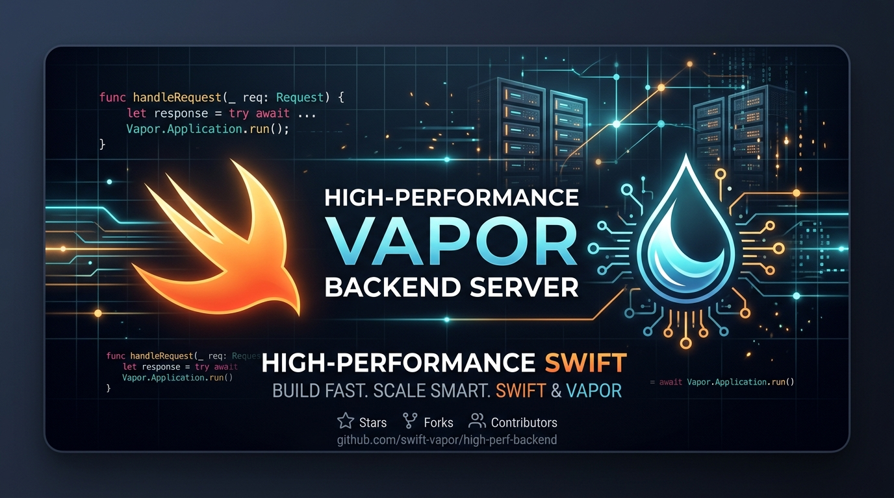
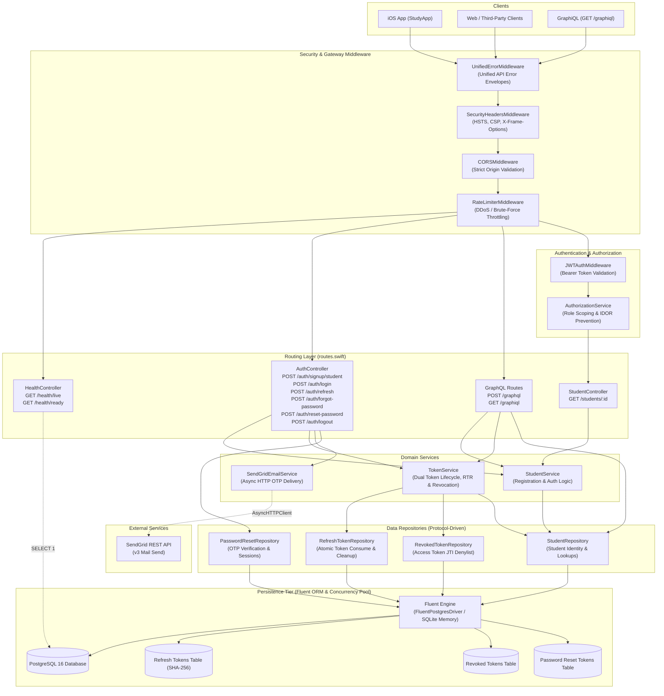

<div align="center">



# StudentAppBackend

**High-performance, production-ready Vapor 4 / Swift 6 backend providing dual REST and GraphQL APIs for student identity and academic lifecycle management.**

<p align="center">
  <a href="https://github.com/rajeshm20/StudentAppBackend/actions/workflows/swift.yml"></a>
  <a href="https://swift.org"></a>
  <a href="https://vapor.codes"></a>
  <a href="https://www.postgresql.org"></a>
  <a href="https://github.com/rajeshm20/StudentAppBackend/pkgs/container/studentappbackend"></a>
  <a href="LICENSE"></a>
</p>

</div>

---

## Table of Contents

- [Overview](#overview)
- [Architecture](#architecture)
- [Tech Stack](#tech-stack)
- [Features](#features)
- [Prerequisites](#prerequisites)
- [Getting Started — Local Development](#getting-started--local-development)
- [Environment Variables](#environment-variables)
- [API Documentation](#api-documentation)
  - [REST Endpoints](#rest-endpoints)
  - [GraphQL Schema & Operations](#graphql-schema--operations)
- [Running Tests](#running-tests)
- [Deployment](#deployment)
  - [Docker & GHCR](#multi-stage-production-docker-build)
  - [Building a Standalone Linux Binary](#building-a-standalone-linux-binary)
  - [Database Migration Runbooks](#database-migration-runbooks)
- [Project Structure](#project-structure)
- [Contributing](#contributing)
- [License and Maintainers](#license-and-maintainers)
- [Acknowledgments](#acknowledgments)

---

## Overview

StudentAppBackend is an enterprise-grade backend service engineered in Swift 6 and Vapor 4 to power school and student identity applications across mobile (iOS) and web clients. It exposes unified REST and GraphQL APIs backed by PostgreSQL 16 via the Fluent ORM, providing identity registration, secure authentication, password recovery, and role-based access control (RBAC). Built with production resiliency in mind, the service enforces strict TLS 1.2+ security controls, fail-loudly environment validations, containerized CI/CD gating, and automated database migration pipelines.

---

## Architecture

The following Mermaid diagram outlines the request lifecycle, illustrating how client requests traverse security middleware, routing layers, business services, and database persistence, as well as background email integration:


```mermaid
flowchart TD
    subgraph Clients["Clients"]
        iOS["iOS App (StudyApp)"]
        Web["Web / Third-Party Clients"]
        Playground["GraphiQL (GET /graphiql)"]
    end

    subgraph SecurityPipeline["Security & Gateway Middleware"]
        UnifiedErr["UnifiedErrorMiddleware<br/>(Unified API Error Envelopes)"]
        SecHeaders["SecurityHeadersMiddleware<br/>(HSTS, CSP, X-Frame-Options)"]
        CORS["CORSMiddleware<br/>(Strict Origin Validation)"]
        RateLimit["RateLimiterMiddleware<br/>(DDoS / Brute-Force Throttling)"]
    end

    subgraph Routing["Routing Layer (routes.swift)"]
        HealthRoutes["HealthController<br/>GET /health/live<br/>GET /health/ready"]
        AuthRoutes["AuthController<br/>POST /auth/signup/student<br/>POST /auth/login<br/>POST /auth/refresh<br/>POST /auth/forgot-password<br/>POST /auth/reset-password<br/>POST /auth/logout"]
        StudentRoutes["StudentController<br/>GET /students/:id"]
        GraphQLRoute["GraphQL Routes<br/>POST /graphql<br/>GET /graphiql"]
    end

    subgraph AuthLayer["Authentication & Authorization"]
        JWTAuth["JWTAuthMiddleware<br/>(Bearer Token Validation)"]
        RoleCheck["AuthorizationService<br/>(Role Scoping & IDOR Prevention)"]
    end

    subgraph Services["Domain Services"]
        TokenSvc["TokenService<br/>(Dual Token Lifecycle, RTR & Revocation)"]
        StudentSvc["StudentService<br/>(Registration & Auth Logic)"]
        EmailSvc["SendGridEmailService<br/>(Async HTTP OTP Delivery)"]
    end

    subgraph Repositories["Data Repositories (Protocol-Driven)"]
        StudentRepo["StudentRepository<br/>(Student Identity & Lookups)"]
        RefreshRepo["RefreshTokenRepository<br/>(Atomic Token Consume & Cleanup)"]
        ResetRepo["PasswordResetRepository<br/>(OTP Verification & Sessions)"]
        RevokedRepo["RevokedTokenRepository<br/>(Access Token JTI Denylist)"]
    end

    subgraph Persistence["Persistence Tier (Fluent ORM & Concurrency Pool)"]
        Fluent["Fluent Engine<br/>(FluentPostgresDriver / SQLite Memory)"]
        Postgres[(PostgreSQL 16 Database)]
        RefreshTokens[("Refresh Tokens Table (SHA-256)")]
        RevokedTokens[("Revoked Tokens Table")]
        ResetTokens[("Password Reset Tokens Table")]
    end

    subgraph External["External Services"]
        SendGrid["SendGrid REST API<br/>(v3 Mail Send)"]
    end

    iOS --> UnifiedErr
    Web --> UnifiedErr
    Playground --> UnifiedErr

    UnifiedErr --> SecHeaders --> CORS --> RateLimit

    RateLimit --> HealthRoutes
    RateLimit --> AuthRoutes
    RateLimit --> GraphQLRoute
    RateLimit --> JWTAuth --> RoleCheck --> StudentRoutes

    AuthRoutes --> StudentSvc
    AuthRoutes --> TokenSvc
    AuthRoutes --> EmailSvc
    GraphQLRoute --> StudentSvc
    GraphQLRoute --> TokenSvc
    StudentRoutes --> StudentSvc

    EmailSvc -.->|"AsyncHTTPClient"| SendGrid
    StudentSvc --> StudentRepo
    TokenSvc --> RefreshRepo
    TokenSvc --> RevokedRepo
    TokenSvc --> StudentRepo
    AuthRoutes --> ResetRepo
    GraphQLRoute --> StudentRepo

    StudentRepo --> Fluent
    RefreshRepo --> Fluent
    ResetRepo --> Fluent
    RevokedRepo --> Fluent

    Fluent --> Postgres
    Fluent --> RefreshTokens
    Fluent --> RevokedTokens
    Fluent --> ResetTokens
    HealthRoutes -.->|"SELECT 1"| Postgres
```

---

## Tech Stack

| Technology | Purpose | Verified Version |
| :--- | :--- | :--- |
| **Swift** | Core programming language | `6.0` (Noble / macOS 13+) |
| **Vapor** | Server-side web framework and HTTP engine | `4.115.0+` |
| **PostgreSQL** | Primary relational database engine | `16-alpine` |
| **Fluent ORM** | Object-relational mapping abstraction | `4.9.0+` |
| **FluentPostgresDriver** | Native asynchronous PostgreSQL driver | `2.8.0+` (NIO < 1.33.0) |
| **FluentMySQLDriver** | Fallback driver for rollback safety net | `4.4.0+` |
| **Graphiti / GraphQL** | Pure Swift GraphQL schema builder & execution | `1.15.0` / `2.10.0` |
| **JWT / JWTKit** | Cryptographic token creation and HS256 signing | `4.0.0+` |
| **AsyncHTTPClient** | High-performance asynchronous HTTP networking | `1.19.0+` |
| **NIOSSL** | TLS 1.2+ enforcement and AEAD cipher suites | `2.65.0+` |
| **SendGrid API** | Transactional email delivery for OTP verification | REST v3 |
| **Docker** | Multi-stage containerization with jemalloc | `24.0+` |

---

## Features

### REST API
- **Canonical Student Registration**: `POST /auth/signup/student` accepts structured profiles, normalizes country codes and phone numbers (E.164), and enforces server-side role assignment (`role: student`).
- **Legacy Signup Compatibility**: `POST /auth/signup` remains operational to support backwards compatibility with legacy client versions.
- **Enumeration-Safe Login**: `POST /auth/login` validates credentials against bcrypt hashes and returns dual tokens (`accessToken` and `refreshToken`).
- **Refresh Token Rotation (RTR)**: `POST /auth/refresh` exchanges a valid refresh token for a brand-new token pair, invalidating the old token and enforcing replay attack detection.
- **Session Revocation**: `POST /auth/logout` invalidates both access tokens and active refresh token families in real-time.
- **Protected Student Resources**: `GET /students/:studentID` enforces fine-grained authorization via `AuthorizationService` to strictly block Insecure Direct Object References (IDOR).
- **Probes**: `GET /health/live` for liveness checks and `GET /health/ready` for database readiness validation (`SELECT 1`).
- **Unified Error Responses**: `UnifiedErrorMiddleware` intercepts all HTTP errors, validation errors, decoding exceptions, and unhandled failures to emit standardized envelopes with deterministic machine error codes (`code`), human-readable messages (`message`), and ISO 8601 timestamps.

### GraphQL API
- **Full-Featured GraphQL Endpoint**: `POST /graphql` provides queries and mutations matching REST parity.
- **Role-Scoped Queries**: `students` query dynamically filters accessible records based on caller role (students only receive their own record; administrators receive all).
- **Mutations**: Native support for `signupStudent`, legacy `signup`, `login`, and profile updates (`updateStudent`).
- **Interactive Playground**: Embedded GraphiQL web console at `GET /graphiql` (automatically disabled in production).

### Authentication & RBAC
- **Dual-Token Lifecycle**: Short-lived HMAC-SHA256 signed access tokens (`JWT_ACCESS_TTL`, default 15 mins) paired with cryptographic refresh tokens (`JWT_REFRESH_TTL`, default 7 days).
- **Refresh Token Rotation (RTR)**: Every refresh operation issues a single-use token pair while revoking the predecessor token.
- **SHA-256 Hashing at Rest**: Refresh tokens are hashed using SHA-256 before database insertion, protecting active sessions against database dump exposure.
- **Automatic Compromise Detection**: Attempting to reuse an already-revoked refresh token triggers automated session family revocation, immediately expelling attackers across all sessions.
- **Role Scoping**: Enforces granular permissions across four defined roles: `admin`, `principal`, `teacher`, and `student`.
- **Database Blacklisting**: Instant access token revocation upon logout, preventing replay attacks before JWT expiration.

### Transactional Email & Password Recovery
- **Two-Phase OTP Password Reset**: 6-digit numeric verification code dispatched via SendGrid with a 10-minute validity window.
- **Brute-Force Safeguard**: Max 3 verification attempts per OTP; automatically marks codes as invalid upon exhaustion.
- **Ephemeral Session Tokens**: Code verification returns an unguessable 32-byte URL-safe session token required to finalize password updates.
- **Console Fallback**: Automatically falls back to console logging when `SENDGRID_API_KEY` is not supplied in local environments.

### Security & Enterprise Hardening
- **Repository Abstraction Layer**: Protocol-driven `StudentRepository`, `RefreshTokenRepository`, `PasswordResetRepository`, and `RevokedTokenRepository` isolate business logic from database drivers, ensuring controllers and GraphQL resolvers are 100% decoupled from direct Fluent ORM calls.
- **Tuned Concurrency & Connection Pooling**: Production-tuned PostgreSQL connection pools (`maxConnectionsPerEventLoop: 8`, `connectionPoolTimeout: 10s`) prevent thread starvation under heavy load.
- **Strict TLS Controls**: Minimum TLS 1.2 enforcement (configurable up to TLS 1.3) with hardened AEAD cipher suites (`ECDHE-*-GCM-*` and `CHACHA20-POLY1305`).
- **HTTP Strict Transport Security (HSTS)**: Configurable HSTS headers with preload list validation and reverse-proxy header trust.
- **Zero Hardcoded Secrets**: Fail-loudly startup validation ensures no production instance runs with default or placeholder database credentials or JWT keys.
- **Hermetic Test Isolation**: Automatic in-memory SQLite isolation for test execution (`app.environment == .testing`), guaranteeing fast and deterministic CI runs without external DB dependencies.

---

## Prerequisites

Ensure the following tools are installed on your host machine before beginning local setup:

| Prerequisite | Minimum Version | Notes |
| :--- | :--- | :--- |
| **Operating System** | macOS 13 (Ventura) or Linux (Ubuntu 22.04+) | Tested on Apple Silicon (arm64) and Linux (x86_64) |
| **Swift Toolchain** | `6.0` | Included in Xcode 16+ or installed via [swift.org](https://swift.org/download/) |
| **Docker Desktop** | `24.0+` | Required for PostgreSQL service containerization |
| **Docker Compose** | `v2.20+` | Bundled with modern Docker Desktop installations |

---

## Getting Started — Local Development

### 1. Clone the Repository

```bash
git clone https://github.com/rajeshm20/StudentAppBackend.git
cd StudentAppBackend
```

### 2. Configure Environment Variables

Create your local `.env` configuration file from the provided example template:

```bash
cp .env.example .env
```

Review `.env` and adjust the variables if needed. For standard local development, the default database settings in `.env.example` map directly to the docker-compose service.

### 3. Start PostgreSQL Database

Launch the PostgreSQL 16 container in detached mode:

```bash
docker compose up db -d
```

Verify that the database is healthy:

```bash
docker compose ps
```

### 4. Apply Database Migrations

Run Fluent migrations against your local PostgreSQL database:

```bash
swift run StudentAppBackend migrate --yes
```

> **Note:** When `AUTO_MIGRATE=true` is set in your `.env`, migrations will execute automatically on startup during local development.

### 5. Build and Run the Server

Compile and boot the server locally:

```bash
swift build
swift run StudentAppBackend serve --hostname 0.0.0.0 --port 8080
```

Once running, verify the service status:

```bash
curl http://localhost:8080/health/ready
# Expected: {"status":"ready"}
```

### Alternative: Run Everything in Docker

To build and run the backend and database entirely inside Docker:

```bash
docker compose up --build
```

Access the API at `http://localhost:8081` (mapped from container port `8080`).

---

## Environment Variables

The application strictly validates environment variables during startup and fails immediately if critical configuration is absent.

### Core Configuration

| Variable | Required | Description | Example / Default |
| :--- | :---: | :--- | :--- |
| `DB_DRIVER` | No | Database driver (`postgres`, `mysql`, `sqlite`) | `postgres` |
| `DATABASE_HOST` | **Yes** | Database server hostname | `localhost` (or `db` in Docker) |
| `DATABASE_PORT` | No | Database port (warns if 3306 is used with postgres) | `5432` |
| `DATABASE_NAME` | **Yes** | Target database schema name | `student_db` |
| `DATABASE_USER` | **Yes** | Database connection username | `studentapp` |
| `DATABASE_PASSWORD` | **Yes** | Database password (**no default in prod**) | *Secret* |
| `DATABASE_TLS_MODE` | No | Database TLS mode (`disable`, `verifyFull`, `noVerify`) | `disable` |
| `JWT_SECRET` | **Yes** | Secret for signing JWTs (min 32 chars in prod) | *Min 32-character secret* |
| `JWT_ACCESS_TTL` | No | JWT access token lifetime in seconds | `900` (15 minutes) |
| `JWT_REFRESH_TTL` | No | Refresh token lifetime in seconds | `604800` (7 days) |
| `TEST_USE_EXTERNAL_DB` | No | Bypass in-memory SQLite isolation in test runs | `false` |
| `ALLOWED_ORIGIN` | **Yes** (Prod) | Explicit CORS origin header | `http://localhost:8081` |

<details>
<summary><strong>View Advanced & Security Environment Variables</strong></summary>

<br/>

| Variable | Required | Description | Example / Default |
| :--- | :---: | :--- | :--- |
| `AUTO_MIGRATE` | No | Auto-apply pending migrations on startup | `true` (dev) / `false` (prod) |
| `ENABLE_GRAPHIQL` | No | Enable `/graphiql` playground (ignored in prod) | `true` |
| `SENDGRID_API_KEY` | No | SendGrid API key (falls back to console email) | `SG.xxxxxxxx` |
| `FROM_EMAIL` | No | Sender email address for transactional emails | `noreply@openedschool.com` |
| `ENABLE_HTTPS` | No | Enable native TLS server listener | `false` |
| `TLS_CERT` | If HTTPS | Path to PEM TLS certificate file | `certs/cert.pem` |
| `TLS_KEY` | If HTTPS | Path to PEM TLS private key file | `certs/key.pem` |
| `TLS_MIN_VERSION` | No | Minimum TLS protocol (`1.2`, `1.3`) | `1.2` |
| `TLS_CIPHER_SUITES`| No | Colon-delimited OpenSSL/IANA cipher list | AEAD/PFS ciphers |
| `AUTO_RENEW_DEV_CERTS` | No | Auto-generate self-signed certs (dev only) | `true` |
| `HSTS_ENABLED` | No | Emit `Strict-Transport-Security` header | `false` (dev) / `true` (prod) |
| `HSTS_MAX_AGE` | No | HSTS cache TTL in seconds | `2592000` (30 days) |
| `HSTS_INCLUDE_SUBDOMAINS` | No | Apply HSTS to all subdomains | `false` |
| `HSTS_PRELOAD` | No | Request inclusion in browser HSTS preload list | `false` |
| `TRUST_PROXY_HEADERS` | No | Trust `X-Forwarded-Proto` behind reverse proxy | `true` |

</details>

---

## API Documentation

### REST Endpoints

| Method | Path | Description | Authentication |
| :--- | :--- | :--- | :---: |
| `GET` | `/health/live` | Service liveness probe | None |
| `GET` | `/health/ready` | Database connection readiness probe | None |
| `POST` | `/auth/signup/student` | Register student account (canonical) | None |
| `POST` | `/auth/signup` | Legacy student registration alias | None |
| `POST` | `/auth/login` | Authenticate and obtain dual token pair (`accessToken` + `refreshToken`) | None |
| `POST` | `/auth/refresh` | Rotate refresh token and obtain new token pair (with reuse detection) | None |
| `POST` | `/auth/forgot-password` | Request password reset verification code | None |
| `POST` | `/auth/verify-reset-code` | Verify 6-digit OTP and obtain session token | None |
| `POST` | `/auth/reset-password` | Reset password using verified session token | None |
| `POST` | `/auth/logout` | Revoke active JWT and invalidate refresh token session family | Bearer JWT |
| `GET` | `/students/:studentID` | Retrieve student profile (IDOR protected) | Bearer JWT |

<details>
<summary><strong>View Sample REST Request & Response Payloads</strong></summary>

#### Student Signup (`POST /auth/signup/student`)

```json
// Request
{
  "firstName": "John",
  "lastName": "Doe",
  "email": "john.doe@example.com",
  "password": "SecurePassword123!",
  "confirmPassword": "SecurePassword123!",
  "countryCode": "+1",
  "contactNumber": "5551234567"
}

// Response (200 OK)
{
  "id": "c3d4e5f6-a7b8-4c9d-0e1f-2a3b4c5d6e7f",
  "name": "John Doe",
  "email": "john.doe@example.com",
  "role": "student",
  "status": "active"
}
```

#### User Login (`POST /auth/login`)

```json
// Request
{
  "email": "john.doe@example.com",
  "password": "SecurePassword123!"
}

// Response (200 OK)
{
  "user": {
    "id": "c3d4e5f6-a7b8-4c9d-0e1f-2a3b4c5d6e7f",
    "name": "John Doe",
    "email": "john.doe@example.com",
    "role": "student",
    "status": "active"
  },
  "token": {
    "token": "eyJhbGciOiJIUzI1NiIsInR5cCI6IkpXVCJ9...",
    "refreshToken": "7a9e2c4d8b1f50a3c2...",
    "tokenType": "Bearer",
    "expiresIn": 900
  },
  "status": "ok",
  "tokens": {
    "accessToken": "eyJhbGciOiJIUzI1NiIsInR5cCI6IkpXVCJ9...",
    "refreshToken": "7a9e2c4d8b1f50a3c2...",
    "tokenType": "Bearer",
    "expiresIn": 900
  }
}
```

#### Token Refresh & Rotation (`POST /auth/refresh`)

```json
// Request
{
  "refreshToken": "7a9e2c4d8b1f50a3c2..."
}

// Response (200 OK)
{
  "accessToken": "eyJhbGciOiJIUzI1NiIsInR5cCI6IkpXVCJ9...",
  "refreshToken": "e3b0c44298fc1c149a...",
  "tokenType": "Bearer",
  "expiresIn": 900
}
```

> **Note on Login Response Backward Compatibility**: The canonical token pair is returned in `tokens` (`accessToken` and `refreshToken`). The top-level `token` object is maintained for legacy client compatibility and is scheduled for deprecation in v2.0.

#### Unified API Error Envelope

```json
// Response (401 Unauthorized)
{
  "error": {
    "code": "UNAUTHORIZED",
    "message": "Invalid email or password",
    "timestamp": "2026-09-20T00:15:30.123Z"
  }
}
```

The error envelope provides a consistent contract across all endpoints:
- `code`: Deterministic machine-readable error identifier (e.g., `BAD_REQUEST`, `UNAUTHORIZED`, `FORBIDDEN`, `NOT_FOUND`, `CONFLICT`, `EMAIL_ALREADY_EXISTS`, `INTERNAL_SERVER_ERROR`).
- `message`: Descriptive human-readable explanation safe for client consumption.
- `timestamp`: ISO 8601 string with millisecond precision recording when the error occurred.

</details>

---

### GraphQL Schema & Operations

Access the GraphQL endpoint at `POST /graphql` or interact visually via the GraphiQL playground at `GET /graphiql`.

#### 1. Student Signup Mutation

```graphql
mutation SignupStudent($input: StudentGraphQLSignupInput!) {
  signupStudent(input: $input) {
    id
    name
    email
    role
  }
}
```

#### 2. User Login Mutation

```graphql
mutation Login($input: StudentGraphQLLoginInput!) {
  login(input: $input) {
    token
    user {
      id
      name
      email
      role
    }
  }
}
```

#### 3. Students Query (Role-Scoped)

> **Note:** Requires `Authorization: Bearer <JWT>` header. Students receive only their own record; administrators receive all records.

```graphql
query GetStudents {
  students {
    id
    name
    email
    role
    phoneNumber
    dob
  }
}
```

---

## Running Tests

The test suite is built on the Swift Testing framework (`Testing` and `VaporTesting`) and executes 125 comprehensive integration and unit tests covering authentication, RBAC, IDOR barriers, schema validation, TLS configurations, and dev certificate lifecycles.

> [!TIP]
> **Zero-Dependency Test Harness**: When running tests (`app.environment == .testing`), the server automatically isolates persistence within an ephemeral in-memory SQLite database (`.sqlite(.memory)`). You do not need PostgreSQL or Docker running to execute the full test suite locally or in CI pipelines. Set `TEST_USE_EXTERNAL_DB=true` if you specifically want to run tests against your configured external database.

Execute all 125 tests locally:

```bash
swift test -v
```

### Test Suite Coverage Highlights
- **Refresh Token Rotation (RTR)**: Validates single-use token rotation, token expiry, cryptographic SHA-256 hash lookups, and session issuance.
- **Compromise Detection & Family Invalidation**: Asserts that attempting to reuse an already-revoked refresh token immediately invalidates the entire session family for that student.
- **Repository Abstraction Layer**: Verifies decoupled persistence logic across `StudentRepository` and `RefreshTokenRepository`.
- **Unified API Error Envelopes**: Tests verify uniform error payloads (`code`, `message`, `timestamp`) across HTTP abort exceptions, malformed request bodies, and unhandled system errors.
- **RBAC & Privilege Escalation**: Tests verify that client-supplied role parameters are discarded during registration.
- **IDOR Prevention**: Asserts that student tokens attempting to access foreign `studentID` records receive `403 Forbidden`.
- **Credential Hygiene**: Validates E.164 phone formatting, password complexity limits, and email normalization.
- **Session Revocation**: Tests verify that blacklisted tokens are immediately rejected by `JWTAuthMiddleware`.
- **TLS & Cipher Invariants**: Asserts that insecure TLS versions (< 1.2) fail validation in production environments.

---

## Deployment

### Multi-Stage Production Docker Build

The project includes an optimized multi-stage `Dockerfile` based on `swift:6.0-noble` and `ubuntu:noble`, utilizing jemalloc memory management and static linking:

```bash
# Build local container
docker build -t studentappbackend:latest .

# Run standalone container
docker run -d \
  -p 8080:8080 \
  --env-file .env \
  --name studentapp-api \
  studentappbackend:latest
```

### GitHub Container Registry (GHCR)

Published container images are automatically built, scanned, and pushed to GHCR on tagged releases and pushes to `main`:

```bash
docker pull ghcr.io/rajeshm20/studentappbackend:latest
docker pull ghcr.io/rajeshm20/studentappbackend:v2.0.0
```

### Building a Standalone Linux Binary

While containerized deployment via Docker is standard and recommended for cloud environments, you can compile a standalone native Linux ELF binary for bare-metal servers, virtual machines, or systemd daemon services.

#### Option A: Native Build on a Linux Host (Ubuntu / Debian)

When building directly on a Linux server or WSL:

```bash
# 1. Install jemalloc performance memory allocator
sudo apt-get update && sudo apt-get install -y libjemalloc-dev

# 2. Compile optimized release binary with statically linked Swift standard library
swift build -c release \
  --product StudentAppBackend \
  --static-swift-stdlib \
  -Xlinker -ljemalloc

# 3. Binary artifact location:
# .build/release/StudentAppBackend
```

#### Option B: Build a Linux Binary from macOS (via Docker)

Because macOS compilers produce Mach-O binaries that cannot execute on Linux, use the official Swift 6 Linux container to produce a Linux ELF executable from your Mac:

```bash
# 1. Compile inside official Swift 6.0 Linux container
docker run --rm \
  -v "$PWD":/workspace \
  -w /workspace \
  swift:6.0-noble \
  swift build -c release --product StudentAppBackend --static-swift-stdlib

# 2. Alternatively, extract the optimized binary directly from the Docker build stage:
docker build --target build -t studentapp-builder .
docker run --rm studentapp-builder cat /staging/StudentAppBackend > ./StudentAppBackend-linux
chmod +x ./StudentAppBackend-linux
```

> [!TIP]
> **Runtime Prerequisites on Linux**: When deploying the raw binary without Docker, ensure the target Linux host has `libjemalloc2` and `ca-certificates` installed (`sudo apt-get install -y libjemalloc2 ca-certificates`). Pass environment variables via a local `.env` file or `EnvironmentFile=/etc/studentapp/.env` in your systemd service unit.


### Database Migration Runbooks

Production cutover and rollback procedures from MySQL to PostgreSQL 16 are located in [`scripts/migration/`](scripts/migration/):
- [`runbook.md`](scripts/migration/runbook.md): Production cutover execution guide.
- [`01-canonicalize.sql`](scripts/migration/01-canonicalize.sql): Source data hygiene script for MySQL.
- [`pgloader.load`](scripts/migration/pgloader.load): pgloader ETL schema and data translation rules.
- [`02-verification.sh`](scripts/migration/02-verification.sh): Automated post-migration row count and MD5 checksum verification.

---

## Project Structure

```text
StudentAppBackend/
├── .github/
│   └── workflows/
│       └── swift.yml               # GitHub Actions CI/CD (Test gating & GHCR publish)
├── certs/                          # Development TLS certificates and keys
├── docker-compose.yml              # Local container stack (API + PostgreSQL 16)
├── docker-compose.package.yml      # Packaged multi-container environment
├── Dockerfile                      # Production multi-stage Docker build
├── Package.swift                   # Swift Package Manager manifest (Swift 6.0)
├── scripts/
│   ├── migration/                  # PostgreSQL migration runbook & verification tools
│   └── renew-dev-certs.sh          # Self-signed dev certificate auto-renewal utility
├── Sources/
│   └── StudentAppBackend/
│       ├── entrypoint.swift        # Application entrypoint & .env bootstrap
│       ├── Configure/              # UnifiedErrorMiddleware, database, JWT, CORS, TLS
│       ├── Controllers/            # Thin REST controllers (Auth, Student, Health)
│       ├── DTOs/                   # Data transfer objects (AuthDTOs, StudentDTOs)
│       ├── GraphQL/                # Graphiti schema definitions & resolvers
│       ├── Migrations/             # Fluent database schema migrations (Students, RefreshTokens)
│       ├── Models/                 # Database entities (Student, RefreshToken, TokenBlacklist)
│       ├── Repositories/           # Data access repositories (StudentRepository, RefreshTokenRepository)
│       ├── Routes/                 # HTTP & GraphQL routing dispatchers
│       └── Services/               # Domain logic (TokenService, StudentService, SendGrid)
├── Specs/                          # Architectural and security specifications
└── Tests/
    └── StudentAppBackendTests/     # Comprehensive 125-test integration & unit suite
```

---

## Contributing

Contributions are welcomed. Please follow these conventions:

1. **Branching Strategy**: Branch from `main` using descriptive prefixes:
   - `feature/short-description`
   - `fix/short-description`
   - `chore/short-description`
2. **Coding Standards**: Adhere to Swift 6 strict concurrency patterns. Business logic must reside in `Services/` rather than inline controller blocks.
3. **Testing**: Every behavioral change must include corresponding tests in `Tests/StudentAppBackendTests/`. All tests must pass cleanly before opening a pull request.
4. **Pull Requests**: Submit PRs against `main`. Provide a concise summary of changes and reference any associated issue numbers.

For detailed guidelines, please review [`CONTRIBUTING.md`](CONTRIBUTING.md).

---

## License and Maintainers

This project is licensed under the terms of the [MIT License](LICENSE).

- **Project Maintainer**: Rajesh Mani ([@rajeshm20](https://github.com/rajeshm20))
- **Repository**: [rajeshm20/StudentAppBackend](https://github.com/rajeshm20/StudentAppBackend)

> **Image Asset Note**: If visual UI screenshots or architecture mockups are added in the future, please place them in `./docs/images/` and link them using standard Markdown syntax.

---

## Acknowledgments

Built with the assistance of AI coding tools (e.g., Claude) for scaffolding and code review; architecture and implementation decisions are my own.
