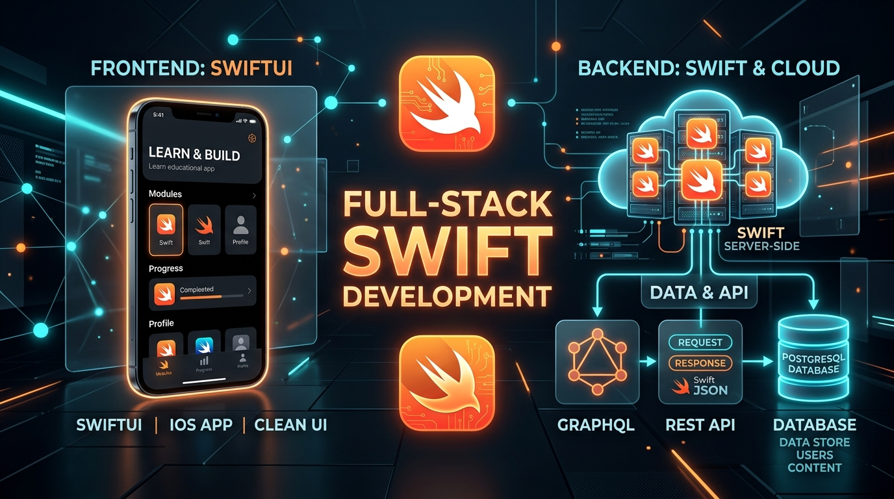

# One Language to Rule the Stack: Building an Enterprise-Grade Full-Stack App with Swift 6, Vapor 4, and SwiftUI



> *How unifying mobile clients and backend infrastructure under Swift 6 delivers unmatched type safety, sub-millisecond concurrency, and extreme developer velocity.*

---

## 1. Introduction: The Full-Stack Swift Paradigm

For years, iOS developers lived in a divided world: we crafted pixel-perfect UI and rock-solid state management in Swift on the client, only to switch context to Node.js, Go, or Python the moment we needed a backend service. 

While polyglot architectures have their place, context switching introduces friction: duplicate model definitions, subtle serialization mismatches, divergent validation rules, and disparate tooling.

With the maturation of **Swift 6** and **Vapor 4**, the vision of **Full-Stack Swift** is no longer an experimental hobby—it is an enterprise-ready reality.

In this deep dive, we break down the architecture of **SchoolBee / StudyApp**, an end-to-end academic lifecycle management ecosystem powered by:
- **Client**: Native iOS application built with **SwiftUI**
- **Server**: High-throughput backend powered by **Vapor 4** and **Swift 6**
- **Persistence**: **PostgreSQL 16** via the **Fluent ORM**
- **APIs**: Dual **REST** and **GraphQL** gateways with interactive GraphiQL tooling
- **DevOps**: Multi-stage Linux Docker containers, GHCR automated pipelines, and automated database migrations

---

## 2. System Architecture: From Pixel to Postgres

The entire platform is engineered around end-to-end type safety, structured concurrency, and defensive security.

```
┌─────────────────────────────────────────────────────────┐
│                    CLIENT LAYER                         │
│   iOS Application (SwiftUI + Async/Await + Keychain)    │
└────────────────────────────┬────────────────────────────┘
                             │ HTTPS / TLS 1.2+
                             ▼
┌─────────────────────────────────────────────────────────┐
│              GATEWAY & SECURITY MIDDLEWARE              │
│  - SecurityHeadersMiddleware (HSTS, CSP, X-Frame)       │
│  - Strict CORSMiddleware & RateLimiter (DDoS Shield)    │
└────────────────────────────┬────────────────────────────┘
                             │
              ┌──────────────┴──────────────┐
              ▼                             ▼
   ┌──────────────────────┐      ┌──────────────────────┐
   │    REST API LAYER    │      │    GRAPHQL LAYER     │
   │  - AuthController    │      │  - Pioneer Engine    │
   │  - StudentController │      │  - Dynamic Queries   │
   │  - HealthController  │      │  - GraphiQL Explorer │
   └──────────┬───────────┘      └──────────┬───────────┘
              │                             │
              └──────────────┬──────────────┘
                             ▼
┌─────────────────────────────────────────────────────────┐
│              AUTHENTICATION & AUTHORIZATION             │
│  - JWT Bearer Token Validation                          │
│  - Centralized Token Revocation (Logout / Invalidation) │
│  - Role-Based Access Control (RBAC & IDOR Prevention)   │
└────────────────────────────┬────────────────────────────┘
                             ▼
┌─────────────────────────────────────────────────────────┐
│                    DOMAIN SERVICES                      │
│   TokenService  •  StudentService  •  SendGridEmail     │
└────────────────────────────┬────────────────────────────┘
                             ▼
┌─────────────────────────────────────────────────────────┐
│                    PERSISTENCE TIER                     │
│      Fluent ORM (FluentPostgresDriver / SQLKit)         │
│                 PostgreSQL 16 Engine                    │
└─────────────────────────────────────────────────────────┘
```

---

## 3. Why Swift on the Server? The Engineering Advantages

### 1. Unified Domain Models & Elimination of Impedance Mismatch
In traditional stacks, an iOS DTO and a backend response schema drift apart easily. In Full-Stack Swift, data contracts can be shared directly:
- Shared validation routines (e.g., email format, password entropy)
- Guaranteed serialization parity with `Codable`
- Compile-time verification across client and server boundaries

### 2. Swift 6 Concurrency & Complete Data Race Safety
Swift 6 enforces compile-time verification of data race safety. By embracing:
- Strongly typed actors
- `Sendable` protocol guarantees across asynchronous boundaries
- Structured concurrency with `async`/`await` and task groups

Our backend services process thousands of simultaneous connections without risk of race conditions or data corruption—all without the CPU overhead of thread thrashing.

### 3. Minimal Memory Footprint & Instant Cold Starts
Unlike JVM runtimes that require gigabytes of heap memory or Node.js runtimes with bloated V8 runtimes, a compiled Swift Linux binary starts in **under 10 milliseconds** and typically runs on **less than 30–50 MB of RAM**. This makes horizontal scaling and container orchestration astonishingly cost-effective.

---

## 4. Dual API Gateways: REST and GraphQL in Harmony

Clients don't all consume data the same way. Rather than forcing a single paradigm, the architecture exposes both **REST** and **GraphQL**:

### REST for Predictable CRUD & Strict Workflows
- Identity lifecycle: Registration, Login, Token Refresh
- Password reset and email OTP verification
- Deterministic HTTP status codes (`201 Created`, `401 Unauthorized`, `409 Conflict`, `429 Too Many Requests`)

### GraphQL for Flexible UI Aggregation
- Integrated via **Pioneer** and **GraphQL-Kit**
- Allows the iOS SwiftUI client to request precisely the student profile attributes, courses, and assignment states needed for a specific view
- Prevents over-fetching and under-fetching over cellular networks
- Built-in GraphiQL interactive playground (`/graphiql`) for rapid developer exploration

---

## 5. Defense-in-Depth: Production Security Hardening

Security is not an afterthought; it is built into every layer of the request pipeline:

1. **Defensive Middlewares**:
   - `SecurityHeadersMiddleware`: Enforces `Strict-Transport-Security` (HSTS), restrictive `Content-Security-Policy` (CSP), and `X-Frame-Options: DENY`.
   - `RateLimiterMiddleware`: In-memory IP and endpoint rate limiting protecting against brute-force password guessing and DDoS.
   - `CORSMiddleware`: Strict origin whitelisting.

2. **Stateful Token Revocation**:
   - Stateless JWTs are fast, but they make immediate revocation tricky. 
   - We implemented a hybrid strategy: tokens are cryptographically verified via JWT, but also checked against a high-speed revoked token registry for immediate session invalidation on logout or password change.

3. **IDOR & Role-Based Access Control (RBAC)**:
   - Deep parameter checking prevents Insecure Direct Object References (IDOR). A student token can never read or mutate another student's academic record.

---

## 6. Cloud-Native DevOps & Deployment

A backend is only as good as its deployment pipeline:
- **Multi-Stage Docker Builds**: Built on Ubuntu Noble, compiling the release binary in a builder stage and copying only the compiled executable and required dynamic libraries into a minimal distroless-like runtime image.
- **Automated CI/CD**: GitHub Actions matrix testing on Swift 6 and automated push to GitHub Container Registry (GHCR).
- **Zero-Downtime Database Migrations**: Fluent migration runbooks decoupled from app boot to ensure high-availability database schema evolutions.
- **Production Reverse Proxy**: Caddy container handling automated Let's Encrypt TLS certificates, HTTP/2 multiplexing, and static asset serving.

---

## 7. Key Takeaways & Lessons Learned

1. **Swift on Linux is genuinely production ready**: Memory consumption is whisper-quiet, CPU utilization stays low, and stability is top tier.
2. **One Mental Model**: Moving between client SwiftUI views and server Vapor controllers without switching languages drastically enhances developer flow state.
3. **Strict Concurrency Pays Off**: Swift 6 compiler errors can be demanding at first, but once the code compiles, concurrency bugs are virtually nonexistent.

---

## Connect & Collaborate

Have you experimented with Server-Side Swift or Vapor? How does your team approach full-stack type safety? 

Let's discuss in the comments below! 🚀

---
*Built with Swift 6, Vapor 4, SwiftUI, and PostgreSQL.*
