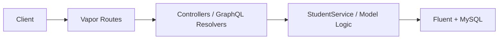
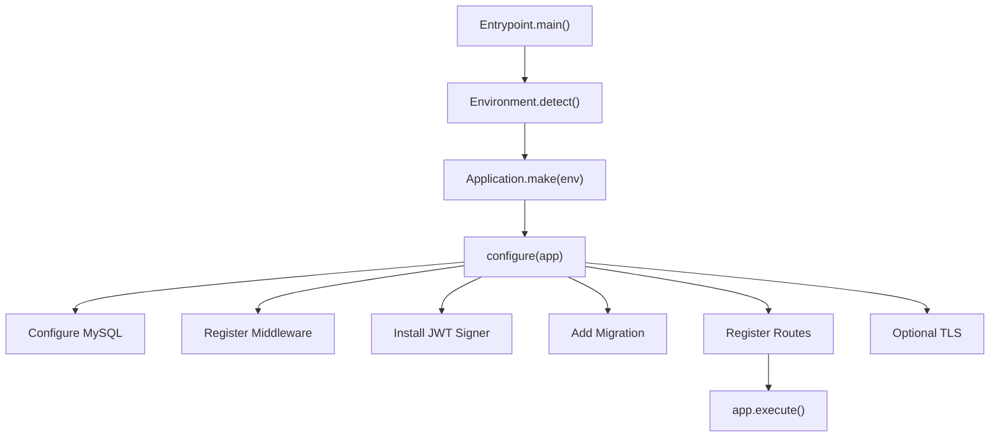
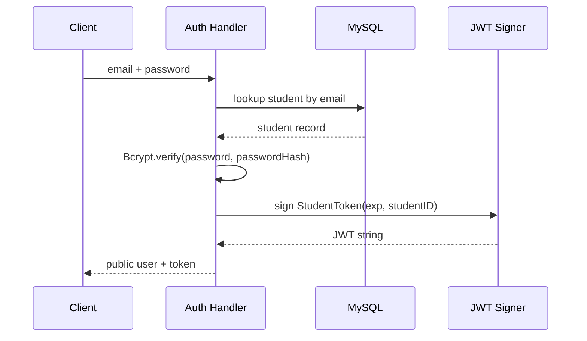
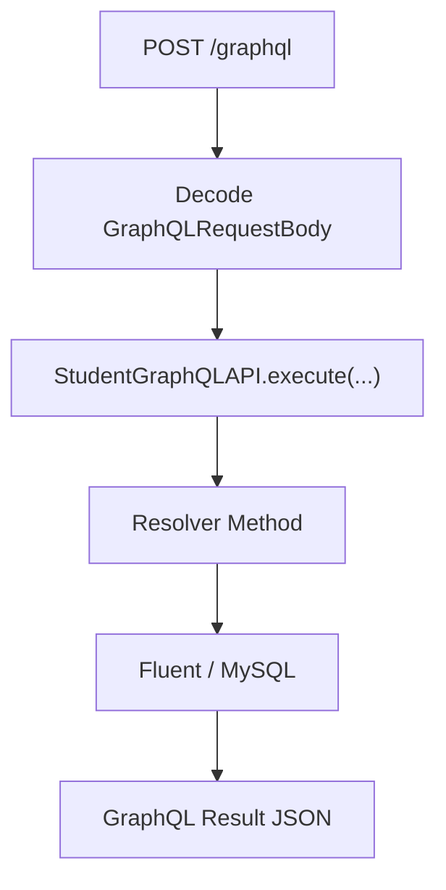

# StudentAppBackend Medium-Style Blog Series

## Series Outline

1. **How Far Can Swift Go on the Server?**
   Why an iOS or Swift engineer would build an experimental backend in pure Swift, and what this project proves.
2. **Inside the Vapor App: Bootstrapping, Configuration, and Runtime Shape**
   A guided walk through `entrypoint.swift`, `configure.swift`, environment handling, TLS, CORS, JWT signer setup, and migrations.
3. **Designing the API Surface: REST, GraphQL, and Route Registration**
   How the project exposes two API styles at once, and what each route actually does.
4. **The Student Domain Model: DTOs, Schema Design, and Validation Gaps**
   How `Student` is modeled, what gets exposed publicly, and where the current code trusts input too much.
5. **JWT Authentication in Practice: What Exists, What’s Missing, and Why It Matters**
   Token creation, claims modeling, token lifetime, missing verification paths, and production implications.
6. **GraphQL in a Vapor App: Queries, Mutations, and the Cost of Convenience**
   How Graphiti is wired into Vapor, how each GraphQL operation behaves, and why `updateStudent` is the most revealing endpoint in the project.
7. **Middleware in the Real World: CORS, Security Headers, and a Custom Rate Limiter**
   Exact middleware ordering, how the rate limiter works, and where the current design will break down.
8. **Error Handling, Status Codes, and the Shape of Failures**
   What Vapor gives you by default, where this code customizes failures, and where API consumers will see inconsistent error payloads.
9. **Database, Migrations, and Persistence: Clean Enough for an Experiment**
   MySQL setup, Fluent usage, migration design, persistence behavior, and missing data-layer boundaries.
10. **Why StudentAppBackend Is a Good Experiment but Not Yet a Production Backend**
    A practical assessment of strengths, risks, missing security controls, performance considerations, and the next engineering steps.

---

# Post 1

## Title
How Far Can Swift Go on the Server?

## Subtitle
What StudentAppBackend gets right as an experimental Vapor backend, and why that matters to iOS and full-stack engineers

## Target audience
iOS developers, Swift engineers, backend developers curious about Vapor, and full-stack engineers evaluating Swift as a server language.

## Estimated reading time
9 minutes

## SEO-friendly summary
This article introduces `StudentAppBackend`, a Vapor-based Swift server that mixes REST and GraphQL, JWT auth, Fluent/MySQL persistence, and custom middleware. It explains why building a backend in pure Swift is technically interesting, where Swift feels genuinely strong on the server, and why this project is best understood as a serious experiment rather than a production-ready system.

## Full article body
There are two common ways to talk about server-side Swift. The first is hype: one language everywhere, shared models, unified teams, and a neat conference talk. The second is dismissal: Swift is for Apple platforms, backend work belongs to Go, Node, Java, Rust, or Kotlin, and anything else is a novelty.

`StudentAppBackend` sits in the more interesting middle ground.

This repository is not trying to be a giant enterprise platform. It is a compact Vapor application with a small student domain, MySQL persistence, JWT login, a REST auth surface, and a parallel GraphQL API. That makes it exactly the kind of codebase worth studying. It is large enough to reveal real engineering tradeoffs, but small enough that you can still hold the whole thing in your head.

The first thing I like about this project is that it does not hide what it is. The structure under [`Sources/StudentAppBackend`](https://github.com/rajeshm20/StudentAppBackend/blob/main/Sources/StudentAppBackend) is direct: configuration, controllers, models, migrations, GraphQL schema, routes, and one small service. This is not a framework demo pretending to be a backend. It is an actual backend prototype built with Vapor.

The second reason it is worth writing about is that it shows where Swift actually feels good on the server.

Swift gives this codebase a few real advantages:

- Strong data modeling for request and response types.
- A readable async model that fits I/O-heavy server work.
- Fluent and Vapor conventions that are much less magical than many dynamic stacks.
- Shared language fluency for iOS teams that want to inspect backend code without changing mental gears.

The core model, for example, is plain Swift. The `Student` model in [`Student.swift`](https://github.com/rajeshm20/StudentAppBackend/blob/main/Sources/StudentAppBackend/Models/Student.swift#L13) defines storage fields, public projections, and request payloads in one place:

```swift
final class Student: Model, Content, @unchecked Sendable {
    static let schema = "students"

    @ID(key: .id)
    var id: UUID?

    @Field(key: "name")
    var name: String

    @Field(key: "email")
    var email: String

    @Field(key: "passwordHash")
    var passwordHash: String
}
```

If you are coming from iOS, that shape feels natural. If you are coming from backend work, it feels disciplined enough to be useful.

But the real value of this project is not that Swift can do backend work. We already know that. The value is that this repository shows exactly where a Swift backend becomes elegant, and exactly where it becomes dangerous if you stop too early.

For example:

- JWT signing is implemented, but JWT verification is not wired into protected routes.
- Password hashing exists, but request validation does not.
- Rate limiting exists, but only in memory.
- Migrations exist, but data access boundaries are still thin.
- GraphQL is present, but authorization is effectively absent.

That combination makes `StudentAppBackend` useful as an engineering specimen. It is opinionated enough to teach from, and incomplete enough to discuss honestly.

The codebase also makes a more subtle point: Swift on the server is at its best when the backend is not trying to imitate another ecosystem. This app is most convincing when it leans into Vapor’s style, Swift’s types, and Fluent’s schema model. It is less convincing when security and production concerns are treated as future polish.

That is not a criticism of the project. It is the real lesson. Many experimental backends look clean because they avoid complexity. This backend looks interesting because it includes enough real concerns to show where the hard parts begin.

At a high level, the app has four layers:



That sounds ordinary, but the interesting part is how those pieces are wired. `configure.swift` builds database connectivity, middleware, JWT signing, migrations, and optional TLS. `routes.swift` registers a REST controller and GraphQL routes. `AuthController.swift` handles signup and login. `GraphQLAPI.swift` exposes student queries and mutations. `RateLimiterMiddleware.swift` adds a custom per-IP rule set. `CreateStudent.swift` defines the schema.

In other words, this is small, but it is not toy-sized.

Over the rest of this series, I am going to treat `StudentAppBackend` as if it were a real backend under technical review. That means:

- documenting every route and GraphQL operation,
- tracing the boot flow from `@main` to middleware to handlers,
- unpacking JWT design and its missing pieces,
- explaining the rate limiter algorithm and its distributed-systems problems,
- looking at schema design, error handling, and persistence,
- and ending with a blunt answer to the question every backend eventually faces:

Would I ship this?

As an experiment: yes.

As production infrastructure: not yet.

That tension is what makes the project worth reading.

## Key code snippets

From [`entrypoint.swift`](https://github.com/rajeshm20/StudentAppBackend/blob/main/Sources/StudentAppBackend/entrypoint.swift#L6):

```swift
@main
enum Entrypoint {
    static func main() async throws {
        var env = try Environment.detect()
        try LoggingSystem.bootstrap(from: &env)

        let app = try await Application.make(env)
        try configure(app)
        try await app.execute()
    }
}
```

From [`routes.swift`](https://github.com/rajeshm20/StudentAppBackend/blob/main/Sources/StudentAppBackend/Routes/routes.swift#L5):

```swift
func routes(_ app: Application) throws {
    try app.register(collection: AuthController())
    try registerGraphQLRoutes(app)
}
```

## What to improve next

- Add a protected route so JWT verification exists in the actual request path, not just in token issuance.
- Add validation for email, password strength, and required fields before discussing security at all.
- Separate “experiment-friendly” shortcuts from “production-safe” defaults through environment-based configuration.

## Tags for Medium
Swift, Vapor, Backend, iOS, GraphQL

---

# Post 2

## Title
Inside the Vapor App: Bootstrapping, Configuration, and Runtime Shape

## Subtitle
From `@main` to database wiring, middleware registration, TLS, and migrations

## Target audience
Swift engineers learning Vapor internals, iOS developers moving toward backend work, and backend engineers reviewing Swift runtime setup.

## Estimated reading time
12 minutes

## SEO-friendly summary
This article walks through how `StudentAppBackend` starts up. It explains the `@main` entrypoint, `configure.swift`, environment-based branching, MySQL setup, CORS, JWT signer registration, middleware order, auto-migrations, and optional TLS. It also calls out where the current configuration is practical for local experimentation but risky for production.

## Full article body
The easiest way to misunderstand a backend is to start with the business logic. In a real server, the control plane matters just as much as the endpoints. How the app boots, what it configures globally, what it trusts from the environment, and which middleware runs first all shape the behavior of every request.

`StudentAppBackend` makes this especially clear because most of the app’s real architecture is concentrated in two files:

- [`entrypoint.swift`](https://github.com/rajeshm20/StudentAppBackend/blob/main/Sources/StudentAppBackend/entrypoint.swift#L6)
- [`configure.swift`](https://github.com/rajeshm20/StudentAppBackend/blob/main/Sources/StudentAppBackend/Configure/configure.swift#L19)

### The real entrypoint is tiny

The app starts exactly where you would expect in modern Vapor:

```swift
@main
enum Entrypoint {
    static func main() async throws {
        var env = try Environment.detect()
        try LoggingSystem.bootstrap(from: &env)

        let app = try await Application.make(env)
        do {
            try configure(app)
            try await app.execute()
        } catch {
            app.logger.report(error: error)
            try? await app.asyncShutdown()
            throw error
        }
        try await app.asyncShutdown()
    }
}
```

This is a good shape. `Environment.detect()` lets Vapor choose modes like development or testing. Logging is bootstrapped before app construction. The real configuration work is delegated to `configure(app)`, which keeps the lifecycle readable.

There is also a commented note about installing SwiftNIO’s event loop group as the global Swift Concurrency executor. That matters because it shows the author is aware of the Swift server runtime boundary between NIO and async/await. Even though it is not enabled, the comment is technically informed and points to a real performance/runtime consideration.

### `configure.swift` is where the backend actually becomes a backend

If you want to understand this codebase, read [`configure.swift`](https://github.com/rajeshm20/StudentAppBackend/blob/main/Sources/StudentAppBackend/Configure/configure.swift#L19) carefully.

This file is doing five important jobs:

1. Configuring MySQL.
2. Registering global middleware.
3. Setting up JWT signing.
4. Running migrations automatically.
5. Optionally enabling TLS.

That is the entire control plane.

### The app branches by environment

The function switches on `app.environment`:

```swift
switch app.environment {
case .testing:
    ...
default:
    ...
}
```

This is a sensible start, but the details are revealing.

In `.testing`, the app:

- uses MySQL with `DATABASE_*` environment variables or local defaults,
- disables DB certificate verification,
- sets a CORS policy for `https://studentapp.ddns.net`,
- registers security headers middleware,
- registers rate limiting,
- installs an HS256 JWT signer with a hard-coded secret,
- runs `CreateStudent()` migration,
- and configures TLS directly with local certificate files while binding to `127.0.0.1:8443`.

In the default branch, the app:

- also uses MySQL with environment-variable fallbacks,
- also disables DB certificate verification,
- sets CORS to `https://127.0.0.1:8080`,
- registers the same middleware,
- conditionally enables HTTPS based on `ENABLE_HTTPS` plus certificate existence,
- installs the same hard-coded HS256 JWT signer,
- runs the same migration,
- and registers routes.

That tells us two things.

First, the app is deliberately shaped for local experimentation and ad hoc deployment rather than strict environment isolation.

Second, the testing branch is doing more than most teams would want a test environment to do. Direct TLS setup in tests and dependence on MySQL mean the tests are closer to integration tests than lightweight unit tests.

### Database configuration is practical, but not hardened

The MySQL connection uses Fluent MySQL:

```swift
app.databases.use(.mysql(
    hostname: Environment.get("DATABASE_HOST") ?? "localhost",
    port: Environment.get("DATABASE_PORT").flatMap(Int.init(_:)) ?? MySQLConfiguration.ianaPortNumber,
    username: Environment.get("DATABASE_USER") ?? "root",
    password: Environment.get("DATABASE_PASSWORD") ?? "newpassword",
    database: Environment.get("DATABASE_NAME") ?? "student_db",
    tlsConfiguration: {
        var tls = TLSConfiguration.makeClientConfiguration()
        tls.certificateVerification = .none
        return tls
    }()
), as: .mysql)
```

This is acceptable for local Docker-based development. It is not acceptable as a production default. The line that disables certificate verification is the most important detail in the block. It means the app is willing to talk to MySQL over TLS without actually verifying the peer.

For experiments, that is common.

For real deployments, it weakens the whole trust model.

### Middleware order is deliberate, and that matters

The middleware stack is registered in this order in both branches:

```swift
app.middleware.use(cors)
app.middleware.use(SecurityHeadersMiddleware())
app.middleware.use(RateLimiterMiddleware())
```

This order is not arbitrary.

- `CORSMiddleware` first makes sure browsers receive the correct CORS behavior as early as possible.
- `SecurityHeadersMiddleware` adds response headers after downstream handling.
- `RateLimiterMiddleware` runs before route handlers and can reject requests with `429 Too Many Requests`.

That order has a subtle effect. Because rate limiting happens after CORS middleware has already been inserted into the chain, even rate-limited browser requests should still have the CORS layer available. That is good API ergonomics.

### JWT is configured globally, but only for signing

The JWT setup is one line:

```swift
app.jwt.signers.use(.hs256(key: "your-secret-key".data(using: .utf8)!))
```

This is enough to sign and verify tokens with Vapor’s JWT support. But in this project, only token creation is implemented in request handlers. There is no route group that calls `req.jwt.verify(...)`, no auth middleware based on `StudentToken`, and no protected resource using that identity.

So this configuration is real, but only half-used.

That is an important theme in this codebase. The project proves token issuance, not end-to-end authenticated request handling.

### Migrations are automatic

The app registers one migration:

```swift
app.migrations.add(CreateStudent())
try app.autoMigrate().wait()
```

Auto-migrating on boot is convenient in development and demos. It is also the easiest way to hide migration failures until runtime. For this project, the tradeoff is acceptable, because there is only one migration and one table. For production, migrations usually belong in an explicit deploy step.

### TLS support is split across two styles

This app supports HTTPS in two different ways:

- direct Vapor TLS configuration in `configure.swift`,
- and reverse-proxy TLS through the repo’s Caddy and Docker setup described in `README.md`.

The helper at [`configure.swift:11`](https://github.com/rajeshm20/StudentAppBackend/blob/main/Sources/StudentAppBackend/Configure/configure.swift#L11) checks `ENABLE_HTTPS` plus certificate file existence:

```swift
private func shouldEnableTLS(certPath: String, keyPath: String) -> Bool {
    let flag = Environment.get("ENABLE_HTTPS")?.lowercased()
    let tlsRequested = flag == "1" || flag == "true" || flag == "yes"
    let hasTLSFiles = FileManager.default.fileExists(atPath: certPath)
        && FileManager.default.fileExists(atPath: keyPath)
    return tlsRequested && hasTLSFiles
}
```

That is a decent local feature gate. The testing branch, however, unconditionally attempts to load certs and bind HTTPS on port `8443`, which is more brittle than the default branch.

### The runtime flow is simple enough to diagram



That is the good news. The boot shape is easy to reason about.

The less good news is that several production-sensitive defaults are still hard-coded or permissive:

- JWT secret is hard-coded.
- DB TLS verification is disabled.
- CORS origin values are manually fixed in code.
- migrations run automatically on startup,
- and debug environment variable dumps exist in the default branch under `#if DEBUG`.

For an experiment, this is fair. For a deployable service, configuration needs to become stricter and more environment-driven.

### What this boot process gets right

The project’s configuration is valuable because it is centralized. You can read one file and understand the runtime.

That is not glamorous, but it is exactly what you want when a backend starts growing. Many small backends become confusing because concerns scatter too early. Here, the app remains inspectable.

That inspectability is one of Swift’s underrated strengths on the server. When the code stays direct, the architecture stays legible.

## Key code snippets

From [`configure.swift`](https://github.com/rajeshm20/StudentAppBackend/blob/main/Sources/StudentAppBackend/Configure/configure.swift#L89):

```swift
let corsConfig = CORSMiddleware.Configuration(
    allowedOrigin: .custom("https://127.0.0.1:8080"),
    allowedMethods: [.GET, .POST, .PUT, .DELETE, .OPTIONS],
    allowedHeaders: [.accept, .authorization, .contentType, .origin, .xRequestedWith],
    allowCredentials: true
)
let cors = CORSMiddleware(configuration: corsConfig)
app.middleware.use(cors)
app.middleware.use(SecurityHeadersMiddleware())
app.middleware.use(RateLimiterMiddleware())
```

From [`configure.swift`](https://github.com/rajeshm20/StudentAppBackend/blob/main/Sources/StudentAppBackend/Configure/configure.swift#L145):

```swift
app.jwt.signers.use(.hs256(key: "your-secret-key".data(using: .utf8)!))
app.migrations.add(CreateStudent())
try app.autoMigrate().wait()
try routes(app)
```

## What to improve next

- Move JWT secrets, CORS origins, DB TLS mode, and HTTPS settings fully into environment configuration.
- Stop using `.wait()` during startup where an async configuration path is available.
- Make the `.testing` environment lighter and less dependent on local TLS assumptions.

## Tags for Medium
Swift, Vapor, Server Side Swift, MySQL, JWT

---

# Post 3

## Title
Designing the API Surface: REST, GraphQL, and Route Registration

## Subtitle
Every endpoint in StudentAppBackend, documented one by one

## Target audience
Backend engineers, API designers, Swift/Vapor developers, and readers who want a concrete map of the service.

## Estimated reading time
14 minutes

## SEO-friendly summary
This article documents every route and GraphQL operation in `StudentAppBackend`. It covers method, path, purpose, request shape, authentication requirements, responses, middleware, and error cases. It also explains why mixing REST and GraphQL in a small backend is both educational and architecturally revealing.

## Full article body
One of the fastest ways to evaluate a backend is to ignore the framework choice and just ask a harder question:

What is the actual API surface?

In `StudentAppBackend`, the answer is compact enough to enumerate completely, which is ideal for analysis. The app exposes:

- two REST endpoints under `/auth`,
- one GraphQL transport endpoint at `/graphql`,
- one GraphiQL UI endpoint at `/graphiql`,
- and five GraphQL operations inside the schema.

The route registration is deliberately small in [`routes.swift`](https://github.com/rajeshm20/StudentAppBackend/blob/main/Sources/StudentAppBackend/Routes/routes.swift#L5):

```swift
func routes(_ app: Application) throws {
    try app.register(collection: AuthController())
    try registerGraphQLRoutes(app)
}
```

That means the app’s public surface splits into two worlds:

- REST for signup and login,
- GraphQL for queries and mirrored mutations.

This is not inherently wrong. In fact, it is a useful experimental pattern because it lets the project compare two API styles over the same domain. But it does create duplication, and duplication is where architectural intent becomes visible.

Let’s document everything precisely.

### Global middleware that affects every route

Before looking at handlers, remember that all public routes pass through:

1. `CORSMiddleware`
2. `SecurityHeadersMiddleware`
3. `RateLimiterMiddleware`

Registered in [`configure.swift:45-47`](https://github.com/rajeshm20/StudentAppBackend/blob/main/Sources/StudentAppBackend/Configure/configure.swift#L45) and again in the default branch at [`configure.swift:99-101`](https://github.com/rajeshm20/StudentAppBackend/blob/main/Sources/StudentAppBackend/Configure/configure.swift#L99).

No route-specific authentication middleware is attached anywhere in the codebase.

That means every route below is currently public unless the handler itself manually checks something. In practice, none of them do.

## REST endpoints

### 1. `POST /auth/signup`

Defined in [`AuthController.swift:21`](https://github.com/rajeshm20/StudentAppBackend/blob/main/Sources/StudentAppBackend/Controllers/AuthController.swift#L21).

#### Purpose
Create a student account.

#### Request body
Decoded from `Student.CreateRequest` in [`Student.swift:65`](https://github.com/rajeshm20/StudentAppBackend/blob/main/Sources/StudentAppBackend/Models/Student.swift#L65):

```json
{
  "name": "Karthick",
  "email": "karthickt@example.com",
  "password": "secret123",
  "dob": "2026-07-18T00:00:00Z",
  "phoneNumber": "1234567890"
}
```

Fields:

- `name: String`
- `email: String`
- `password: String`
- `dob: Date?`
- `phoneNumber: String?`

#### Authentication required
No.

#### Middleware involved

- CORS
- Security headers
- Rate limiting: default rule `100 requests / 60 seconds` per IP and route path

#### Handler behavior

1. Decode JSON body.
2. Hash the password with `Bcrypt.hash`.
3. Create a `Student`.
4. Save to MySQL through Fluent.
5. Return `Student.Public`.

#### Response shape

Returns a public student object without `passwordHash`:

```json
{
  "id": "UUID",
  "name": "Karthick",
  "email": "karthickt@example.com",
  "dob": "2026-07-18T00:00:00Z",
  "phoneNumber": "1234567890"
}
```

#### Error cases

- `400 Bad Request` if body decoding fails.
- Database error if the unique email constraint is violated.
- Unhandled persistence errors bubble through Vapor.

#### Important tradeoff
There is no validation layer before hashing or saving. Empty names, malformed emails, and weak passwords are not filtered in application code.

### 2. `POST /auth/login`

Defined in [`AuthController.swift:39`](https://github.com/rajeshm20/StudentAppBackend/blob/main/Sources/StudentAppBackend/Controllers/AuthController.swift#L39).

#### Purpose
Authenticate a student and return a JWT.

#### Request body
Decoded from `Student.LoginRequest` in [`Student.swift:57`](https://github.com/rajeshm20/StudentAppBackend/blob/main/Sources/StudentAppBackend/Models/Student.swift#L57):

```json
{
  "email": "karthickt@example.com",
  "password": "secret123"
}
```

#### Authentication required
No.

#### Middleware involved

- CORS
- Security headers
- Rate limiting: stricter rule `5 requests / 60 seconds` per IP for routes beginning with `/auth/login`

#### Handler behavior

1. Decode credentials.
2. Look up the student by email through `StudentService.authenticate`.
3. Verify password with `Bcrypt.verify`.
4. Build a `StudentToken`.
5. Sign JWT with `req.jwt.sign`.
6. Return user plus token.

#### Response shape

From `LoginResponse` in [`AuthController.swift:54`](https://github.com/rajeshm20/StudentAppBackend/blob/main/Sources/StudentAppBackend/Controllers/AuthController.swift#L54):

```json
{
  "user": {
    "id": "UUID",
    "name": "Karthick",
    "email": "karthickt@example.com",
    "dob": null,
    "phoneNumber": null
  },
  "token": {
    "token": "jwt-string"
  },
  "status": "ok"
}
```

#### Error cases

- `401 Unauthorized` for invalid email/password.
- `400 Bad Request` for decode failures.
- DB lookup failures bubble up.

#### Important tradeoff
The route issues a token, but there is no downstream protected REST endpoint that uses it.

## Transport routes outside REST

### 3. `POST /graphql`

Defined in [`graphqlRoutes.swift:8`](https://github.com/rajeshm20/StudentAppBackend/blob/main/Sources/StudentAppBackend/Routes/graphqlRoutes.swift#L8).

#### Purpose
Accept GraphQL requests and execute them against `StudentGraphQLAPI`.

#### Request body
Decoded from `GraphQLRequestBody` in [`GraphQLAPI.swift:7`](https://github.com/rajeshm20/StudentAppBackend/blob/main/Sources/StudentAppBackend/GraphQL/GraphQLAPI.swift#L7):

```json
{
  "query": "{ students { id name email } }",
  "operationName": null,
  "variables": {}
}
```

#### Authentication required
No.

#### Middleware involved

- CORS
- Security headers
- Rate limiting: default rule `100 requests / 60 seconds` per IP and route path `/graphql`

#### Response shape
Always HTTP `200 OK` if execution reaches GraphQL, even when the GraphQL payload contains errors. The body is JSON-encoded GraphQL result data.

#### Error cases

- `400 Bad Request` if the transport body itself cannot be decoded.
- GraphQL execution errors appear inside the GraphQL result payload.

### 4. `GET /graphiql`

Defined in [`graphqlRoutes.swift:22`](https://github.com/rajeshm20/StudentAppBackend/blob/main/Sources/StudentAppBackend/Routes/graphqlRoutes.swift#L22).

#### Purpose
Serve an in-browser GraphiQL interface for testing the API.

#### Authentication required
No.

#### Middleware involved

- CORS
- Security headers
- Rate limiting: default rule `100 requests / 60 seconds`

#### Response shape
Static HTML page with embedded docs and a GraphiQL client.

#### Important tradeoff
This is excellent for developer ergonomics and questionable for unrestricted production exposure.

## GraphQL operations

These are not separate HTTP routes, but they are separate public API operations and should be documented like first-class endpoints.

### 5. GraphQL query `students`

Defined in [`GraphQLAPI.swift:22`](https://github.com/rajeshm20/StudentAppBackend/blob/main/Sources/StudentAppBackend/GraphQL/GraphQLAPI.swift#L22) and registered in the schema at [`GraphQLAPI.swift:188-190`](https://github.com/rajeshm20/StudentAppBackend/blob/main/Sources/StudentAppBackend/GraphQL/GraphQLAPI.swift#L188).

#### Purpose
Return all students.

#### Inputs
None.

#### Authentication required
No.

#### Response shape
List of `Student.Public` values.

#### Error cases
Database read errors bubble as GraphQL errors.

#### Important tradeoff
This exposes all students to any caller with no auth. That is fine for a demo and unacceptable for real user data.

### 6. GraphQL query `student(id: UUID!)`

Defined in [`GraphQLAPI.swift:29`](https://github.com/rajeshm20/StudentAppBackend/blob/main/Sources/StudentAppBackend/GraphQL/GraphQLAPI.swift#L29).

#### Purpose
Fetch a single student by ID.

#### Inputs

- `id: UUID!`

#### Authentication required
No.

#### Response shape
`Student.Public` or `null`.

#### Error cases
Database read failures become GraphQL errors. Missing records return `null`, not `404`.

### 7. GraphQL mutation `signup(input: StudentGraphQLCreateInput!)`

Defined in [`GraphQLAPI.swift:39`](https://github.com/rajeshm20/StudentAppBackend/blob/main/Sources/StudentAppBackend/GraphQL/GraphQLAPI.swift#L39).

#### Purpose
Create a student through GraphQL.

#### Inputs

- `name`
- `email`
- `password`
- optional `dob`
- optional `phoneNumber`

#### Authentication required
No.

#### Response shape
`Student.Public`

#### Error cases
Same practical failures as REST signup: body shape issues at GraphQL input parsing, unique email failures, DB errors.

#### Important tradeoff
This duplicates the REST signup behavior almost exactly.

### 8. GraphQL mutation `login(input: StudentGraphQLLoginInput!)`

Defined in [`GraphQLAPI.swift:64`](https://github.com/rajeshm20/StudentAppBackend/blob/main/Sources/StudentAppBackend/GraphQL/GraphQLAPI.swift#L64).

#### Purpose
Authenticate and return a JWT plus public user data.

#### Inputs

- `email`
- `password`

#### Authentication required
No.

#### Response shape

```json
{
  "data": {
    "login": {
      "user": {
        "id": "UUID",
        "name": "Graph User",
        "email": "graphql@example.com"
      },
      "token": "jwt-string"
    }
  }
}
```

#### Error cases
Invalid credentials become a GraphQL error derived from `Abort(.unauthorized, reason: "Invalid email or password")`.

### 9. GraphQL mutation `updateStudent(input: StudentGraphQLUpdateInput!)`

Defined in [`GraphQLAPI.swift:86`](https://github.com/rajeshm20/StudentAppBackend/blob/main/Sources/StudentAppBackend/GraphQL/GraphQLAPI.swift#L86).

#### Purpose
Update a student record by ID.

#### Inputs
The input type defines:

- `id: UUID`
- `dob: Date?`
- `name: String?`
- `phoneNumber: String?`

But only `id` and `dob` are registered in the GraphQL schema at [`GraphQLAPI.swift:182-185`](https://github.com/rajeshm20/StudentAppBackend/blob/main/Sources/StudentAppBackend/GraphQL/GraphQLAPI.swift#L182).

That means `name` and `phoneNumber` exist in Swift but are not actually exposed in the GraphQL input schema.

#### Authentication required
No.

#### Response shape
Updated `Student.Public`.

#### Error cases

- `404`-equivalent GraphQL error if the student is not found.
- DB save failures surface as GraphQL errors.

#### Important tradeoff
This is the most sensitive route in the app. It mutates student data without authentication or authorization.

## Why mixing REST and GraphQL is useful here

In a larger system, I would push hard for clearer boundaries. In this project, the duplication is educational.

It lets you compare:

- transport ergonomics,
- response modeling,
- error shapes,
- and the reuse of domain logic between controllers and GraphQL resolvers.

What it also reveals is that a shared security model has not been applied across both API styles. That is the biggest architectural lesson in the whole surface area.

## Key code snippets

From [`AuthController.swift`](https://github.com/rajeshm20/StudentAppBackend/blob/main/Sources/StudentAppBackend/Controllers/AuthController.swift#L15):

```swift
func boot(routes: any RoutesBuilder) throws {
    let authRoutes = routes.grouped("auth")
    authRoutes.post("signup", use: signup)
    authRoutes.post("login", use: login)
}
```

From [`graphqlRoutes.swift`](https://github.com/rajeshm20/StudentAppBackend/blob/main/Sources/StudentAppBackend/Routes/graphqlRoutes.swift#L8):

```swift
app.post("graphql") { req async throws -> Response in
    let graphQLRequest = try req.content.decode(GraphQLRequestBody.self).graphQLRequest()
    let result = try await api.execute(
        request: graphQLRequest,
        context: req,
        on: req.application.eventLoopGroup
    )
    ...
}
```

## What to improve next

- Add authenticated route groups for any student read or update operation.
- Decide whether the service wants REST, GraphQL, or both, then remove redundant paths.
- Standardize error payloads across REST and GraphQL-facing auth failures.

## Tags for Medium
API Design, Swift, Vapor, REST, GraphQL

---

# Post 4

## Title
The Student Domain Model: DTOs, Schema Design, and Validation Gaps

## Subtitle
Why the model layer is clean enough to teach from, and too trusting to ship unchanged

## Target audience
Swift backend engineers, iOS developers used to DTO-heavy code, and engineers designing request/response contracts.

## Estimated reading time
10 minutes

## SEO-friendly summary
This article explores the `Student` model in `StudentAppBackend`, including Fluent fields, public response projection, request DTOs, and the database schema migration. It also highlights the project’s biggest omission at the input boundary: almost no validation.

## Full article body
There is a lot to like about the way `StudentAppBackend` models its core entity.

The `Student` type in [`Student.swift`](https://github.com/rajeshm20/StudentAppBackend/blob/main/Sources/StudentAppBackend/Models/Student.swift#L13) is both concise and honest. It tells you the entire domain immediately:

```swift
final class Student: Model, Content, @unchecked Sendable {
    static let schema = "students"

    @ID(key: .id)
    var id: UUID?

    @Field(key: "name")
    var name: String

    @Field(key: "email")
    var email: String

    @Field(key: "passwordHash")
    var passwordHash: String

    @Field(key: "dob")
    var dob: Date?

    @Field(key: "phoneNumber")
    var phoneNumber: String?
}
```

That is a good model for a small backend. It is not overloaded with protocol tricks, repository abstractions, or separate persistence and API twins for every use case. For an experimental backend, this is a strength.

### Public projection is handled correctly

One of the most important design decisions in the file is the nested `Public` type:

```swift
struct Public: Content {
    var id: UUID?
    var name: String
    var email: String
    var dob: Date?
    var phoneNumber: String?
}
```

And the projection helper:

```swift
func convertToPublic() -> Public {
    return Public(id: id, name: name, email: email, dob: dob, phoneNumber: phoneNumber)
}
```

This is exactly the kind of small defensive boundary I want to see in a young backend. The app never returns `passwordHash` in a response because it has a dedicated public view model.

This matters more than it looks. Plenty of prototype backends accidentally serialize storage models directly. This project does not make that mistake.

### Request DTOs are embedded close to the model

The login and creation payloads are defined inside or alongside the model:

```swift
struct LoginRequest: Content {
    let email: String
    let password: String
}

extension Student {
    struct CreateRequest: Content {
        let name: String
        let email: String
        let password: String
        let dob: Date?
        let phoneNumber: String?
    }
}
```

This is a pragmatic choice. The app is small enough that keeping the request types near the model improves discoverability. If the service grows, I would likely split DTOs into a separate namespace or folder. Right now, the coupling is reasonable.

### The migration matches the model well

The database schema in [`CreateStudent.swift`](https://github.com/rajeshm20/StudentAppBackend/blob/main/Sources/StudentAppBackend/Migrations/CreateStudent.swift#L12) is consistent with the model:

```swift
try await database.schema("students")
    .id()
    .field("name", .string, .required)
    .field("email", .string, .required)
    .unique(on: "email")
    .field("passwordHash", .string, .required)
    .field("dob", .date)
    .field("phoneNumber", .string)
    .create()
```

That gives you:

- UUID primary key
- required `name`
- required unique `email`
- required `passwordHash`
- optional `dob`
- optional `phoneNumber`

This is a clean first schema. The unique constraint on email is especially important because it offloads one critical integrity rule to the database.

### But the validation story is almost nonexistent

This is where the project stops being “clean and compact” and starts being “still experimental.”

There is no validation middleware.

There are no `Validations` conformances.

There is no explicit check for:

- malformed email addresses,
- blank strings,
- password length,
- password complexity,
- maximum field sizes,
- impossible `dob` values,
- or `phoneNumber` formatting.

That means the backend mostly relies on:

- JSON decoding to reject malformed types,
- and the database unique constraint to reject duplicate emails.

Those are not the same thing as validation.

For example, the following request is structurally valid from the app’s perspective:

```json
{
  "name": "",
  "email": "not-an-email",
  "password": "1",
  "phoneNumber": "abc"
}
```

Nothing in the controller rejects it before persistence.

### The GraphQL input types mirror the same strength and weakness

In [`GraphQLAPI.swift`](https://github.com/rajeshm20/StudentAppBackend/blob/main/Sources/StudentAppBackend/GraphQL/GraphQLAPI.swift#L113), the GraphQL input types are similarly straightforward:

```swift
struct StudentGraphQLCreateInput: Codable {
    let name: String
    let email: String
    let password: String
    let dob: Date?
    let phoneNumber: String?
}
```

Again, that is easy to understand.

Again, it has no validation layer beyond GraphQL type shape.

The backend therefore has consistent data-transfer modeling across REST and GraphQL, but consistently weak input policing across both.

### There is also a small schema mismatch worth noticing

`StudentGraphQLUpdateInput` defines:

```swift
struct StudentGraphQLUpdateInput: Codable {
    let id: UUID
    let dob: Date?
    let name: String?
    let phoneNumber: String?
}
```

But the GraphQL schema only registers:

```swift
Input(StudentGraphQLUpdateInput.self) {
    InputField("id", at: \.id)
    InputField("dob", at: \.dob)
}
```

So the Swift type advertises more than the GraphQL schema actually exposes. That is a small inconsistency, but it matters. It suggests the update feature is still evolving, and the codebase has already drifted slightly between internal intent and public API.

### Why this model layer still works as a teaching example

Even with those gaps, I would still point Swift developers at this model layer as a good early-server example.

Why?

Because it shows a sane baseline:

- one storage model,
- one public projection,
- small request DTOs,
- a matching migration,
- and Fluent fields that align with the actual schema.

That is a much healthier starting point than over-abstracting a tiny service into generic repositories on day one.

The correct next move is not “make the architecture more clever.” The correct next move is “add validation and stronger boundaries at the edges.”

That is a much better problem to have.

## Key code snippets

From [`Student.swift`](https://github.com/rajeshm20/StudentAppBackend/blob/main/Sources/StudentAppBackend/Models/Student.swift#L45):

```swift
struct Public: Content {
    var id: UUID?
    var name: String
    var email: String
    var dob: Date?
    var phoneNumber: String?
}
```

From [`CreateStudent.swift`](https://github.com/rajeshm20/StudentAppBackend/blob/main/Sources/StudentAppBackend/Migrations/CreateStudent.swift#L13):

```swift
func prepare(on database: any Database) async throws {
    try await database.schema("students")
        .id()
        .field("name", .string, .required)
        .field("email", .string, .required)
        .unique(on: "email")
        .field("passwordHash", .string, .required)
        .create()
}
```

## What to improve next

- Add Vapor validations for signup and GraphQL input equivalents.
- Introduce explicit max lengths at both validation and schema levels.
- Decide whether `dob` and `phoneNumber` are real domain requirements or optional experiments.

## Tags for Medium
Swift, Vapor, Fluent, API Design, Validation

---

# Post 5

## Title
JWT Authentication in Practice: What Exists, What’s Missing, and Why It Matters

## Subtitle
Token creation is implemented; token-based access control is not

## Target audience
Backend engineers, Swift/Vapor developers, and anyone reviewing auth design in small services.

## Estimated reading time
12 minutes

## SEO-friendly summary
This article analyzes JWT handling in `StudentAppBackend`, including signer configuration, claims modeling, token creation in REST and GraphQL login flows, token expiry, and missing verification paths. It explains why the project demonstrates authentication mechanics but not complete authorization.

## Full article body
Authentication code is often where experimental backends reveal whether they are merely functional or actually trustworthy.

`StudentAppBackend` has real JWT issuance. It does not yet have real JWT-protected application behavior.

That distinction is the entire story.

### Where the JWT signer is configured

The global signer is installed in [`configure.swift:48`](https://github.com/rajeshm20/StudentAppBackend/blob/main/Sources/StudentAppBackend/Configure/configure.swift#L48) and again in the default branch at [`configure.swift:146`](https://github.com/rajeshm20/StudentAppBackend/blob/main/Sources/StudentAppBackend/Configure/configure.swift#L146):

```swift
app.jwt.signers.use(.hs256(key: "your-secret-key".data(using: .utf8)!))
```

This means:

- algorithm: `HS256`
- key type: symmetric shared secret
- secret source: hard-coded string literal

From a mechanics perspective, that works.

From a security perspective, it is the most obviously non-production line in the whole codebase.

Hard-coded shared secrets are fine for demos, screenshots, and local experiments. They are not acceptable for deployed systems.

### How claims are modeled

The JWT payload lives in [`StudentToken.swift`](https://github.com/rajeshm20/StudentAppBackend/blob/main/Sources/StudentAppBackend/Controllers/StudentToken.swift#L11):

```swift
struct StudentToken: JWTPayload {
    var exp: ExpirationClaim
    var studentID: UUID

    func verify(using signer: JWTSigner) throws {
        try self.exp.verifyNotExpired()
    }
}
```

This token includes exactly two claims:

- `exp`
- `studentID`

That is minimal, and minimal is not inherently bad. Plenty of systems overstuff JWTs.

But minimal claims also mean the token does not carry:

- issuer,
- audience,
- subject,
- issued-at,
- not-before,
- role,
- scope,
- or session/version metadata.

Again, that is acceptable for a prototype whose only purpose is “can we sign and return a token?” It is not enough for a service that wants durable security semantics.

### Where tokens are created

There are two token issuance paths.

#### REST login

In [`AuthController.swift:44-47`](https://github.com/rajeshm20/StudentAppBackend/blob/main/Sources/StudentAppBackend/Controllers/AuthController.swift#L44):

```swift
let expiration = ExpirationClaim(value: .init(timeIntervalSinceNow: 60)) // 1 hour
let payload = StudentToken(exp: expiration, studentID: try student.requireID())
let token = try req.jwt.sign(payload)
```

There is an important bug hiding in plain sight here. The comment says “1 hour.” The code uses `60`, which means `60 seconds`.

This is exactly the kind of mismatch a good auth review should catch.

#### GraphQL login

In [`GraphQLAPI.swift:75-77`](https://github.com/rajeshm20/StudentAppBackend/blob/main/Sources/StudentAppBackend/GraphQL/GraphQLAPI.swift#L75):

```swift
let expiration = ExpirationClaim(value: Date(timeIntervalSinceNow: 60))
let payload = StudentToken(exp: expiration, studentID: try student.requireID())
let token = try request.jwt.sign(payload)
```

GraphQL uses the same `60-second` lifetime.

So across both login paths, the effective token behavior is:

- create JWT with `studentID`
- expire in one minute
- sign with shared hard-coded HS256 secret

### Where tokens are verified

This is the most important section of the article because it is so short.

The token’s `verify(using:)` function checks expiry.

But there is no request path anywhere in the codebase that verifies incoming JWTs for authorization.

I searched the codebase for JWT usage and found:

- signer setup in `configure.swift`
- payload definition in `StudentToken.swift`
- token creation in REST login
- token creation in GraphQL login

I did not find:

- `req.jwt.verify(...)`
- auth middleware using `StudentToken`
- `Authenticator` conformance
- `GuardMiddleware`
- protected route groups
- GraphQL context auth extraction

That means the code demonstrates token issuance, not session-backed access control.

### Authorization is effectively absent

Because the app does not verify JWTs for protected resources, it also does not implement authorization.

That has practical consequences:

- all GraphQL reads are public,
- `updateStudent` is public,
- there is no “current user” route,
- there is no ownership check,
- and there is no admin/user distinction.

So when we talk about “authentication and authorization” in this project, we need to be precise.

Authentication exists only in the sense that valid credentials can produce a signed token.

Authorization does not exist as an enforced runtime policy.

### No refresh token strategy is present

The prompt for this series specifically asked about refresh behavior, so let’s be explicit: there is no refresh token strategy in the current codebase.

No route or mutation provides refresh.

No refresh token model exists.

No revocation list exists.

No rotation strategy exists.

No device/session store exists.

This matters even more because the access token lifetime is effectively one minute. Short-lived access tokens can be a good idea, but only if paired with a refresh flow or some other session renewal mechanism. Here, they are not.

### The JWT flow as implemented



Notice what is missing: no later request comes back through a verifier.

### The project’s auth design is still useful

This might sound harsh, but I do not think the JWT code is a failure. I think it is honest prototype code.

It already teaches several real lessons:

- how Vapor installs signers,
- how to model a payload,
- how to issue JWTs from REST and GraphQL,
- how to avoid returning password hashes,
- and how easy it is to stop too early and accidentally think “auth is done.”

That last lesson is the important one.

Plenty of small backends reach exactly this stage: login works, token appears, demo succeeds, and the system still has no meaningful protected access path.

That is not a Swift problem. That is a backend engineering problem.

## Key code snippets

From [`StudentToken.swift`](https://github.com/rajeshm20/StudentAppBackend/blob/main/Sources/StudentAppBackend/Controllers/StudentToken.swift#L11):

```swift
struct StudentToken: JWTPayload {
    var exp: ExpirationClaim
    var studentID: UUID

    func verify(using signer: JWTSigner) throws {
        try self.exp.verifyNotExpired()
    }
}
```

From [`AuthController.swift`](https://github.com/rajeshm20/StudentAppBackend/blob/main/Sources/StudentAppBackend/Controllers/AuthController.swift#L39):

```swift
func login(req: Request) async throws -> LoginResponse {
    let credentials = try req.content.decode(Student.LoginRequest.self)
    guard let student = try await StudentService.shared.authenticate(credentials: credentials, on: req.db) else {
        throw LoginError(status: .unauthorized, message: Abort(.unauthorized, reason: "Invalid email or password").localizedDescription)
    }
    let expiration = ExpirationClaim(value: .init(timeIntervalSinceNow: 60))
    let payload = StudentToken(exp: expiration, studentID: try student.requireID())
    let token = try req.jwt.sign(payload)
    return LoginResponse(...)
}
```

## What to improve next

- Move the signing key to environment-backed secret management.
- Correct the token lifetime bug or the misleading comment.
- Add real protected routes with JWT verification and ownership checks.
- Add refresh tokens if one-minute access tokens remain the design.

## Tags for Medium
JWT, Authentication, Swift, Vapor, Security

---

# Post 6

## Title
GraphQL in a Vapor App: Queries, Mutations, and the Cost of Convenience

## Subtitle
How Graphiti is wired into StudentAppBackend, and where the schema is stronger than the security model

## Target audience
Swift backend engineers, GraphQL practitioners, and Vapor developers comparing REST and GraphQL ergonomics.

## Estimated reading time
12 minutes

## SEO-friendly summary
This article explains how `StudentAppBackend` integrates GraphQL with Graphiti and Vapor. It covers transport decoding, schema construction, resolvers, all queries and mutations, GraphiQL, and the current security limitations of exposing read and update operations without authentication.

## Full article body
Small backends rarely need both REST and GraphQL. That is part of what makes this project interesting.

In `StudentAppBackend`, GraphQL is not bolted on as an afterthought. It has its own route registration, transport decoding, schema builder, resolvers, and an embedded GraphiQL page.

That is substantial enough to analyze on its own.

### The transport layer is simple and clean

The GraphQL HTTP entrypoint lives in [`graphqlRoutes.swift:8`](https://github.com/rajeshm20/StudentAppBackend/blob/main/Sources/StudentAppBackend/Routes/graphqlRoutes.swift#L8):

```swift
app.post("graphql") { req async throws -> Response in
    let graphQLRequest = try req.content.decode(GraphQLRequestBody.self).graphQLRequest()
    let result = try await api.execute(
        request: graphQLRequest,
        context: req,
        on: req.application.eventLoopGroup
    )

    let response = Response(status: .ok)
    response.headers.contentType = .json
    response.body = .init(data: try JSONEncoder().encode(result))
    return response
}
```

And the request envelope is modeled in [`GraphQLAPI.swift:7`](https://github.com/rajeshm20/StudentAppBackend/blob/main/Sources/StudentAppBackend/GraphQL/GraphQLAPI.swift#L7):

```swift
struct GraphQLRequestBody: Content, @unchecked Sendable {
    let query: String
    let operationName: String?
    let variables: [String: Map]?
}
```

This is a good example of Swift keeping transport code straightforward. The backend decodes a conventional GraphQL envelope, turns it into a `GraphQLRequest`, and executes it with the Vapor `Request` as context.

### The schema is defined in code, not scattered

The schema builder in [`GraphQLAPI.swift:150`](https://github.com/rajeshm20/StudentAppBackend/blob/main/Sources/StudentAppBackend/GraphQL/GraphQLAPI.swift#L150) is one of the nicer pieces of the codebase:

```swift
try Graphiti.Schema<GraphQLResolver, Request> {
    Scalar(UUID.self)
    Scalar(Date.self)

    Type(Student.Public.self) {
        Field("id", at: \.id)
        Field("name", at: \.name)
        Field("email", at: \.email)
        Field("dob", at: \.dob)
        Field("phoneNumber", at: \.phoneNumber)
    }

    Query {
        Field("students", at: GraphQLResolver.students)
        Field("student", at: GraphQLResolver.student) {
            Argument("id", at: \.id)
        }
    }
}
```

This is exactly what a GraphQL schema should feel like in a statically typed server: explicit, composable, and inspectable.

### Resolver design is pragmatic

The `GraphQLResolver` mixes two patterns:

- methods returning `EventLoopFuture`
- and one async method for `updateStudent`

That inconsistency is not elegant, but it is common in evolving Vapor codebases. It reflects the practical reality of GraphQL-on-Vapor integration more than a deep design problem.

### Query: `students`

Implementation:

```swift
func students(request: Request, arguments: NoArguments) throws -> EventLoopFuture<[Student.Public]> {
    request.eventLoop.makeFutureWithTask {
        let students = try await Student.query(on: request.db).all()
        return students.map { $0.convertToPublic() }
    }
}
```

This is the simplest read path in the whole app. It loads every student and maps to public output.

It is also the clearest example of why schema elegance is not enough. Without pagination, auth, or filtering, this query is fine for demos and poor for production.

### Query: `student(id: UUID!)`

Implementation:

```swift
func student(request: Request, arguments: StudentByIDArguments) throws -> EventLoopFuture<Student.Public?> {
    request.eventLoop.makeFutureWithTask {
        guard let student = try await Student.find(arguments.id, on: request.db) else {
            return nil
        }
        return student.convertToPublic()
    }
}
```

This is a reasonable GraphQL shape. Missing data returns `null` rather than an HTTP `404`, which matches GraphQL norms.

Again, no auth.

### Mutation: `signup`

The GraphQL signup mutation mirrors the REST signup flow closely:

```swift
let hashedPassword = try Bcrypt.hash(create.password)
let student = Student(
    id: UUID(),
    name: create.name,
    email: create.email,
    passwordHash: hashedPassword,
    dob: create.dob,
    phoneNumber: create.phoneNumber
)
try await student.save(on: request.db)
return student.convertToPublic()
```

That reuse is conceptually sound, though it is duplicated logic rather than shared domain code. If the service grows, signup should likely move behind a dedicated application service so REST and GraphQL do not each own password hashing and persistence flow separately.

### Mutation: `login`

The login mutation delegates password verification to `StudentService.authenticate`, then signs JWT:

```swift
guard let student = try await StudentService.shared.authenticate(credentials: credentials, on: request.db) else {
    throw Abort(.unauthorized, reason: "Invalid email or password")
}

let expiration = ExpirationClaim(value: Date(timeIntervalSinceNow: 60))
let payload = StudentToken(exp: expiration, studentID: try student.requireID())
let token = try request.jwt.sign(payload)
```

This is mechanically correct and architecturally incomplete for the same reasons as REST login.

### Mutation: `updateStudent`

This is the mutation that tells you most about the maturity of the backend:

```swift
func updateStudent(context: Request, arguments: UpdateArguments) async throws -> Student.Public {
    guard let student = try await Student.find(arguments.input.id, on: context.db) else {
        throw Abort(.notFound, reason: "Student not found")
    }

    if let dob = arguments.input.dob {
        student.dob = dob
    }

    try await student.save(on: context.db)
    return student.convertToPublic()
}
```

Observations:

- it updates by arbitrary ID,
- it has no authentication,
- it has no authorization,
- it only applies `dob`,
- and it ignores `name` and `phoneNumber` even though those exist on the Swift input type.

This is the best example of a feature that is real enough to demo and incomplete enough to critique.

### GraphiQL is a great developer feature

`GET /graphiql` serves a custom HTML page with a built-in docs tab and sample operations. For local development, this is excellent. It lowers the barrier to exploring the API and makes the backend feel friendlier to inspect.

For production, I would gate it behind environment checks or remove it from public deployments.

### GraphQL request flow



### The core tradeoff

The GraphQL side of this app is technically more interesting than the REST side. It proves:

- custom schema construction,
- typed inputs and outputs,
- GraphiQL integration,
- JWT issuance from mutations,
- and mixed query/mutation support.

But it also amplifies the app’s missing security model, because GraphQL makes data exposure and mutation very convenient. Convenience without policy is how small backends leak into dangerous territory.

In that sense, the GraphQL portion is not just a feature. It is the best stress test of the project’s architectural maturity.

## Key code snippets

From [`GraphQLAPI.swift`](https://github.com/rajeshm20/StudentAppBackend/blob/main/Sources/StudentAppBackend/GraphQL/GraphQLAPI.swift#L188):

```swift
Query {
    Field("students", at: GraphQLResolver.students)
    Field("student", at: GraphQLResolver.student) {
        Argument("id", at: \.id)
    }
}

Mutation {
    Field("signup", at: GraphQLResolver.signup) {
        Argument("input", at: \.input)
    }
    Field("login", at: GraphQLResolver.login) {
        Argument("input", at: \.input)
    }
    Field("updateStudent", at: GraphQLResolver.updateStudent) {
        Argument("input", at: \.input)
    }
}
```

From [`graphqlRoutes.swift`](https://github.com/rajeshm20/StudentAppBackend/blob/main/Sources/StudentAppBackend/Routes/graphqlRoutes.swift#L22):

```swift
app.get("graphiql") { _ in
    GraphiQLPage.html(endpoint: "/graphql")
}
```

## What to improve next

- Protect student reads and writes with auth-aware GraphQL context handling.
- Remove input/schema mismatches in `StudentGraphQLUpdateInput`.
- Add pagination, filtering, and explicit field-level authorization decisions.

## Tags for Medium
GraphQL, Swift, Vapor, Backend Engineering, API

---

# Post 7

## Title
Middleware in the Real World: CORS, Security Headers, and a Custom Rate Limiter

## Subtitle
A practical look at request interception, response hardening, and why in-memory throttling is only a first step

## Target audience
Backend engineers, Swift server developers, security-minded API builders.

## Estimated reading time
13 minutes

## SEO-friendly summary
This article analyzes the middleware chain in `StudentAppBackend`, including exact registration order, the custom security headers middleware, and the rate limiter actor. It explains the rate-limiting algorithm, per-IP and per-route behavior, reset windows, and limitations in multi-instance deployments.

## Full article body
Middleware is where backend philosophy becomes executable.

If routes define what an app can do, middleware defines the conditions under which it gets to do it.

`StudentAppBackend` has a small but meaningful middleware stack:

1. `CORSMiddleware`
2. `SecurityHeadersMiddleware`
3. `RateLimiterMiddleware`

Registered in [`configure.swift`](https://github.com/rajeshm20/StudentAppBackend/blob/main/Sources/StudentAppBackend/Configure/configure.swift#L45) and [`configure.swift:99`](https://github.com/rajeshm20/StudentAppBackend/blob/main/Sources/StudentAppBackend/Configure/configure.swift#L99).

That is a good place to start because the order is intentional.

## Why middleware order matters


In practice:

- CORS should run early because browsers care before your business logic does.
- Security headers mutate the response on the way back out.
- Rate limiting should reject abusive traffic before handlers do expensive work.

This stack is simple and reasonable. The problems are not in the order. The problems are in the scope and sophistication of what each layer enforces.

## CORS: explicit, narrow, and a little rigid

The app manually configures allowed origins:

- testing branch: `https://studentapp.ddns.net`
- default branch: `https://127.0.0.1:8080`

Allowed methods:

- `GET`
- `POST`
- `PUT`
- `DELETE`
- `OPTIONS`

Allowed headers:

- `accept`
- `authorization`
- `contentType`
- `origin`
- `xRequestedWith`

Credentials are enabled.

This tells us the service is designed with browser-based clients in mind. That is good.

The tradeoff is that CORS policy is hard-coded in application code instead of being environment-driven. That makes deployment shape and code shape too tightly coupled.

## Security headers: a useful baseline with one caveat

The custom middleware in [`SecurityHeadersMiddleware.swift`](https://github.com/rajeshm20/StudentAppBackend/blob/main/Sources/StudentAppBackend/Configure/SecurityHeadersMiddleware.swift#L11) adds:

- `Strict-Transport-Security`
- `X-Content-Type-Options`
- `X-Frame-Options`
- `Referrer-Policy`
- `Permissions-Policy`
- `Content-Security-Policy`

Implementation:

```swift
res.headers.replaceOrAdd(name: "Strict-Transport-Security", value: "max-age=63072000; includeSubDomains; preload")
res.headers.replaceOrAdd(name: "X-Content-Type-Options", value: "nosniff")
res.headers.replaceOrAdd(name: "X-Frame-Options", value: "DENY")
res.headers.replaceOrAdd(name: "Referrer-Policy", value: "strict-origin-when-cross-origin")
res.headers.replaceOrAdd(name: "Permissions-Policy", value: "geolocation=(), microphone=(), camera=()")
res.headers.replaceOrAdd(name: "Content-Security-Policy", value: "default-src 'self'; script-src 'self'; style-src 'self' 'unsafe-inline'; img-src 'self' data:")
```

This is a good instinct. Many small backends omit response hardening entirely.

The caveat is `Strict-Transport-Security`. HSTS only makes sense when the app is actually served over HTTPS consistently. In development or mixed deployment setups, setting it blindly can be misleading. The app does support HTTPS in some modes, but the header policy is not conditional on whether HTTPS is truly enforced in front of clients.

## The rate limiter is the most interesting middleware in the project

The custom limiter in [`RateLimiterMiddleware.swift`](https://github.com/rajeshm20/StudentAppBackend/blob/main/Sources/StudentAppBackend/Configure/RateLimiterMiddleware.swift#L59) uses an actor-backed in-memory store:

```swift
actor RateLimiterStore {
    private var clients: [String: [String: (count: Int, resetTime: Date)]] = [:]
    // clients[ip] = [route: (count, resetTime)]
}
```

That means the key space is:

- first key: client IP
- second key: request path

Each record stores:

- request count
- reset time

### Algorithm used

This is a fixed-window counter, not a token bucket and not a sliding window.

The logic is:

1. Look up the current `(count, resetTime)` for `ip + route`.
2. If `now > resetTime`, start a new window with count `1`.
3. Else increment count.
4. Reject if `count > maxRequests`.

Implementation:

```swift
if var record = routeLimits[route] {
    if now > record.resetTime {
        record = (1, now.addingTimeInterval(TimeInterval(windowSeconds)))
    } else {
        record.count += 1
    }
    routeLimits[route] = record
    clients[ip] = routeLimits
    return record.count <= maxRequests
} else {
    routeLimits[route] = (1, now.addingTimeInterval(TimeInterval(windowSeconds)))
    clients[ip] = routeLimits
    return true
}
```

### Per-route behavior

The middleware special-cases login:

```swift
if route.starts(with: "/auth/login") {
    return (5, 60)
} else {
    return (100, 60)
}
```

So the effective policy is:

- `/auth/login`: `5 requests / 60 seconds / IP / route`
- everything else: `100 requests / 60 seconds / IP / route`

### What it protects well

For a single-process demo deployment, this is a good start.

It protects against:

- brute-force login bursts from one visible IP,
- accidental loops from frontend clients,
- and noisy local misuse during development.

### Edge cases and limitations

This design has several important limitations:

1. **In-memory only**
   A server restart clears all counters.

2. **Single-instance only**
   In distributed deployments, each instance would keep separate counters. A load balancer would make the limit inconsistent.

3. **Per-route string matching**
   The key uses `request.url.path`. Different paths are isolated, which is good for specificity, but no normalization or broader identity policy exists.

4. **Per-IP identity is weak**
   NATs, shared networks, reverse proxies, and missing trusted proxy handling can make IP-based policies unfair or easy to misread.

5. **No headers describing rate-limit state**
   The app returns `429`, but it does not include `Retry-After` or limit headers.

6. **No cleanup strategy**
   Old client entries remain in memory until overwritten by the same keys. For a tiny demo, this is fine. For a long-lived process under varied traffic, it is not.

7. **GraphQL gets the generic bucket**
   `POST /graphql` can execute cheap queries and expensive mutations under the same `100/60s` path-level limit.

### Error behavior

If the limit is exceeded, the middleware throws:

```swift
throw Abort(.tooManyRequests, reason: "Too many requests to \(route). Try again later.")
```

That produces HTTP `429 Too Many Requests`.

This is correct semantically. It would be better with retry metadata.

### The middleware story is promising

What I like here is not that the middleware is perfect. It is not. What I like is that the app already treats cross-cutting concerns as first-class concerns.

There is a clear place for:

- browser policy,
- security response hardening,
- abuse throttling.

That is a solid backbone for a small server.

The next step is not inventing more middleware. It is making the existing middleware production-aware.

## Key code snippets

From [`RateLimiterMiddleware.swift`](https://github.com/rajeshm20/StudentAppBackend/blob/main/Sources/StudentAppBackend/Configure/RateLimiterMiddleware.swift#L84):

```swift
final class RateLimiterMiddleware: AsyncMiddleware {
    private let store = RateLimiterStore()

    func respond(to request: Request, chainingTo next: any AsyncResponder) async throws -> Response {
        let ip = request.remoteAddress?.ipAddress ?? "unknown"
        let route = request.url.path
        ...
    }
}
```

From [`SecurityHeadersMiddleware.swift`](https://github.com/rajeshm20/StudentAppBackend/blob/main/Sources/StudentAppBackend/Configure/SecurityHeadersMiddleware.swift#L11):

```swift
struct SecurityHeadersMiddleware: AsyncMiddleware {
    func respond(to request: Request, chainingTo next: any AsyncResponder) async throws -> Response {
        let res = try await next.respond(to: request)
        res.headers.replaceOrAdd(name: "X-Frame-Options", value: "DENY")
        ...
        return res
    }
}
```

## What to improve next

- Move rate-limit storage to Redis or another shared backend for multi-instance deployments.
- Add `Retry-After` and optional limit headers.
- Normalize trusted proxy behavior before treating remote IP as a meaningful identity boundary.
- Make HSTS conditional on actual HTTPS-only deployments.

## Tags for Medium
Middleware, Swift, Vapor, Rate Limiting, Security

---

# Post 8

## Title
Error Handling, Status Codes, and the Shape of Failures

## Subtitle
Where Vapor helps, where StudentAppBackend customizes behavior, and where clients will feel inconsistencies

## Target audience
API designers, backend engineers, and developers integrating clients against this service.

## Estimated reading time
10 minutes

## SEO-friendly summary
This article reviews error handling in `StudentAppBackend`, covering Vapor’s default `Abort` behavior, login-specific custom error types, GraphQL error payloads, database failures, and status-code mapping. It explains why the current backend works but returns inconsistent failure shapes across API styles.

## Full article body
The success path is only half of an API contract. The failure path is where clients discover whether a backend was designed or merely assembled.

`StudentAppBackend` has enough error handling to be useful, but not enough consistency to be finished.

### What Vapor already gives this app

For many failures, the backend relies on Vapor defaults:

- request decode failures,
- thrown `Abort` errors,
- unhandled async failures,
- database exceptions bubbling up from Fluent.

That is not lazy. Vapor’s defaults are perfectly reasonable for a small service. The problem is that once you customize one error path, clients begin expecting deliberate behavior everywhere.

### REST login uses a custom error type

In [`AuthController.swift:41-43`](https://github.com/rajeshm20/StudentAppBackend/blob/main/Sources/StudentAppBackend/Controllers/AuthController.swift#L41), failed login becomes:

```swift
throw LoginError(
    status: .unauthorized,
    message: Abort(.unauthorized, reason: "Invalid email or password").localizedDescription
)
```

And `LoginError` is defined as:

```swift
struct LoginError: Error, Codable, Content {
    let status: HTTPStatus
    let message: String
}
```

This suggests the author wanted a structured auth failure payload rather than a plain `Abort`.

That is a reasonable idea.

The issue is that the app does not then establish a broader error-handling convention around it.

### Signup does not mirror login’s explicit failure modeling

`POST /auth/signup` does not wrap failures in a custom error type. A duplicate email, for example, is likely to emerge as a database-layer failure rather than a neat business error.

So the REST API already has inconsistent failure semantics:

- login has a custom auth failure type,
- signup largely depends on framework and DB behavior,
- decode failures remain default,
- validation failures do not exist because validation does not exist.

### GraphQL has a totally different error shape

GraphQL operations execute under GraphQL’s result envelope. That means application errors do not naturally map to standalone HTTP error responses in the same way as REST.

For example, failed GraphQL login throws:

```swift
throw Abort(.unauthorized, reason: "Invalid email or password")
```

The transport route still responds with `200 OK` after GraphQL execution, and the actual failure appears in the GraphQL `errors` array.

That is standard GraphQL behavior. It is also a significant integration difference for clients using both REST and GraphQL in the same service.

### API-by-API error mapping

#### `POST /auth/signup`

Likely error cases:

- `400` if JSON decode fails.
- DB error on duplicate `email`.
- unexpected DB or runtime error for persistence failures.

#### `POST /auth/login`

Likely error cases:

- `400` if decode fails.
- `401` for invalid credentials.
- DB lookup failure if persistence layer fails.

#### `POST /graphql`

Likely error cases:

- `400` if the GraphQL envelope cannot be decoded.
- `200` with GraphQL `errors` payload for resolver failures, invalid credentials, not-found mutation paths, or DB failures during resolver execution.

#### `GET /graphiql`

This is mostly static HTML. Failure modes are minimal unless the route is unavailable or middleware rejects it.

### Missing domain-level error modeling

This backend would benefit from an explicit domain error layer for cases like:

- duplicate email
- invalid credentials
- missing student
- forbidden student mutation
- invalid input constraints

Right now, different layers own different pieces of failure behavior:

- controllers,
- GraphQL resolvers,
- database constraints,
- Vapor decode failures,
- and middleware.

That is workable in a prototype. It becomes hard to maintain as soon as external consumers depend on stable contracts.

### A good production rule of thumb

Clients should be able to answer three questions from any failure:

1. What went wrong?
2. Was it the client’s fault or the server’s fault?
3. Is the response shape stable enough to automate against?

`StudentAppBackend` answers these inconsistently today.

### The project still does one important thing right

It mostly uses semantically correct HTTP status codes when it does choose them:

- `401 Unauthorized` for invalid login
- `404 Not Found` semantics in `updateStudent`
- `429 Too Many Requests` for throttling

That is a better foundation than many early backends have.

The next step is not inventing exotic error abstractions. It is standardizing what is already starting to emerge.

## Key code snippets

From [`AuthController.swift`](https://github.com/rajeshm20/StudentAppBackend/blob/main/Sources/StudentAppBackend/Controllers/AuthController.swift#L59):

```swift
struct LoginError: Error, Codable, Content {
    let status: HTTPStatus
    let message: String
}
```

From [`RateLimiterMiddleware.swift`](https://github.com/rajeshm20/StudentAppBackend/blob/main/Sources/StudentAppBackend/Configure/RateLimiterMiddleware.swift#L102):

```swift
guard allowed else {
    throw Abort(.tooManyRequests, reason: "Too many requests to \(route). Try again later.")
}
```

## What to improve next

- Add a shared error response strategy for REST endpoints.
- Map DB uniqueness failures to friendly domain errors.
- Decide on a stable GraphQL error extension format if GraphQL remains public.

## Tags for Medium
Error Handling, APIs, Swift, Vapor, Backend

---

# Post 9

## Title
Database, Migrations, and Persistence: Clean Enough for an Experiment

## Subtitle
How Fluent and MySQL are used, and where the current persistence layer stops short of a richer architecture

## Target audience
Swift backend developers, Fluent users, and engineers evaluating simple persistence design in small services.

## Estimated reading time
11 minutes

## SEO-friendly summary
This article examines persistence in `StudentAppBackend`, including MySQL setup, the `Student` Fluent model, the `CreateStudent` migration, query patterns, and the small `StudentService`. It explains why the data layer is readable and workable for a prototype, while still missing several production-quality patterns.

## Full article body
Persistence is where small backends usually make one of two mistakes:

- they stay too thin and let every route talk to the database however it wants,
- or they overreact and build an unnecessary abstraction maze.

`StudentAppBackend` leans toward the first mistake, but not disastrously so.

### The database choice is straightforward

The app uses:

- Fluent
- Fluent MySQL Driver
- MySQL

Declared in [`Package.swift`](https://github.com/rajeshm20/StudentAppBackend/blob/main/Package.swift#L9).

That is a sensible stack for a small Vapor backend. MySQL is familiar, operationally boring in a good way, and well-supported enough for the project’s needs.

### The model and migration are aligned

I already covered the `Student` model and migration in a previous article, but they matter here because persistence quality begins with structural consistency.

The good news:

- schema and model fields match,
- email is unique,
- password is stored as a hash, not plaintext,
- optional profile fields are modeled as optional in both code and schema.

For a first domain table, that is solid.

### Query patterns are simple and readable

The app mostly uses Fluent directly at the edges.

Examples:

Fetch by email in [`StudentService.swift:22-29`](https://github.com/rajeshm20/StudentAppBackend/blob/main/Sources/StudentAppBackend/Services/StudentService.swift#L22):

```swift
guard let student = try await Student.query(on: db)
    .filter(\.$email == credentials.email)
    .first()
else {
    return nil
}
```

Fetch all in [`GraphQLAPI.swift:24`](https://github.com/rajeshm20/StudentAppBackend/blob/main/Sources/StudentAppBackend/GraphQL/GraphQLAPI.swift#L24):

```swift
let students = try await Student.query(on: request.db).all()
```

Fetch by ID in [`GraphQLAPI.swift:31`](https://github.com/rajeshm20/StudentAppBackend/blob/main/Sources/StudentAppBackend/GraphQL/GraphQLAPI.swift#L31):

```swift
guard let student = try await Student.find(arguments.id, on: request.db) else {
    return nil
}
```

These are clean, direct Fluent calls. For a codebase this size, that directness is a feature.

### `StudentService` is small, but reveals an architectural fork

The whole service layer is tiny:

```swift
struct StudentService {
    static let shared = StudentService()

    func create(student: Student, on db: any Database) async throws {
        student.passwordHash = try Bcrypt.hash(student.passwordHash)
        try await student.save(on: db)
    }

    func authenticate(credentials: Student.LoginRequest, on db: any Database) async throws -> Student? {
        ...
    }
}
```

Two details matter here.

First, only `authenticate` is actually used by the rest of the code. Signup logic in both REST and GraphQL hashes passwords inline rather than delegating to `StudentService.create`.

Second, `create(student:)` expects `student.passwordHash` to contain the raw password before hashing. That naming makes the method slightly dangerous. A property named `passwordHash` is being used as a transient plaintext carrier at the moment the service is called.

That is not currently causing a bug because the method is not used. It is still a design smell.

### The persistence layer is thin by design

This backend does not have:

- repositories,
- domain aggregates,
- transaction orchestration,
- read/write model separation,
- or dedicated data-access boundaries for GraphQL versus REST.

For a one-model app, that is okay. The code remains readable.

But once you have both REST and GraphQL doing overlapping writes, shared application logic becomes more important. Right now, signup logic is duplicated. That is an early sign that persistence-adjacent domain behavior wants a better home.

### Migration strategy

The app has exactly one migration and auto-runs it on startup.

That is ideal for experiments:

- low ceremony
- quick bootstrapping
- minimal deployment friction

It is less ideal when:

- multiple services share the DB,
- migrations become order-sensitive,
- or runtime startup time should not include schema changes.

Again, the code is not wrong. It is appropriately immature for its current scale.

### One overlooked production concern: indexing

The unique email constraint implies an index for that field, which helps auth lookup.

But if the student domain grows, you would want to think about:

- created-at / updated-at timestamps,
- soft delete policy,
- audit fields,
- and query patterns beyond exact lookup or full-table scan.

Today, the app can get away with simple queries because the feature set is tiny.

### Testing tells us what the author values

The test suite in [`StudentAppBackendTests.swift`](https://github.com/rajeshm20/StudentAppBackend/blob/main/Tests/StudentAppBackendTests/StudentAppBackendTests.swift#L24) covers:

- REST signup
- REST login
- GraphQL signup

That suggests the current persistence confidence is centered on account creation and auth flows, not on broader data integrity or mutation policy.

I could not complete `swift test` in this sandbox because SwiftPM failed during manifest evaluation under sandbox restrictions rather than from an application assertion failure, so I am basing this on source inspection of the test file itself. The test intent is still informative.

### Overall assessment

The persistence design is good enough for an experimental backend because it is:

- readable,
- unsurprising,
- close to the framework,
- and not abstracted into useless complexity.

It is not yet good enough for a larger codebase because:

- domain logic is duplicated,
- service boundaries are incomplete,
- and security-relevant write behavior is still handler-owned.

That is a normal place for a project like this to be.

## Key code snippets

From [`StudentService.swift`](https://github.com/rajeshm20/StudentAppBackend/blob/main/Sources/StudentAppBackend/Services/StudentService.swift#L22):

```swift
func authenticate(credentials: Student.LoginRequest, on db: any Database) async throws -> Student? {
    guard let student = try await Student.query(on: db).filter(\.$email == credentials.email).first() else {
        return nil
    }
    guard try Bcrypt.verify(credentials.password, created: student.passwordHash) else {
        return nil
    }
    return student
}
```

From [`StudentAppBackendTests.swift`](https://github.com/rajeshm20/StudentAppBackend/blob/main/Tests/StudentAppBackendTests/StudentAppBackendTests.swift#L59):

```swift
@Test("Test Login Route")
func testLogin() async throws {
    try await withApp { app in
        let signupPayload = ["name": "Karthick", "email": "karthickt@example.com", "password": "secret123"]
        try await app.testing().test(.POST, "auth/signup", beforeRequest: { req in
            try req.content.encode(signupPayload)
        })
        ...
    }
}
```

## What to improve next

- Consolidate signup and update behavior into real application services.
- Add timestamps and stronger auditability to the schema.
- Add test coverage for duplicate emails, login failure, rate limiting, and `updateStudent`.

## Tags for Medium
Fluent, MySQL, Swift, Vapor, Persistence

---

# Post 10

## Title
Why StudentAppBackend Is a Good Experiment but Not Yet a Production Backend

## Subtitle
The practical verdict on architecture, security, performance, and what should change before real deployment

## Target audience
Engineering leads, backend developers, Swift teams evaluating server-side Swift for real systems.

## Estimated reading time
13 minutes

## SEO-friendly summary
This final article evaluates `StudentAppBackend` as a whole. It explains what the project gets right as an experimental Swift backend, why Vapor and Swift are a compelling combination, and which issues must be addressed before production: secret management, auth enforcement, validation, rate-limit storage, GraphQL authorization, error consistency, and operational hardening.

## Full article body
After walking through `StudentAppBackend` file by file, the right conclusion is neither “Swift on the server is perfect” nor “this proves Swift should stay on iOS.”

The correct conclusion is more useful:

This project is a good experimental backend precisely because it is ambitious enough to expose real problems.

That is a compliment.

### What the project gets right

Let’s start with the strengths, because they are real.

#### 1. The codebase is small but structurally legible

The main entrypoints are easy to find:

- [`entrypoint.swift`](https://github.com/rajeshm20/StudentAppBackend/blob/main/Sources/StudentAppBackend/entrypoint.swift#L6)
- [`configure.swift`](https://github.com/rajeshm20/StudentAppBackend/blob/main/Sources/StudentAppBackend/Configure/configure.swift#L19)
- [`routes.swift`](https://github.com/rajeshm20/StudentAppBackend/blob/main/Sources/StudentAppBackend/Routes/routes.swift#L5)
- [`AuthController.swift`](https://github.com/rajeshm20/StudentAppBackend/blob/main/Sources/StudentAppBackend/Controllers/AuthController.swift#L14)
- [`GraphQLAPI.swift`](https://github.com/rajeshm20/StudentAppBackend/blob/main/Sources/StudentAppBackend/GraphQL/GraphQLAPI.swift#L138)
- [`Student.swift`](https://github.com/rajeshm20/StudentAppBackend/blob/main/Sources/StudentAppBackend/Models/Student.swift#L13)
- [`CreateStudent.swift`](https://github.com/rajeshm20/StudentAppBackend/blob/main/Sources/StudentAppBackend/Migrations/CreateStudent.swift#L12)
- [`RateLimiterMiddleware.swift`](https://github.com/rajeshm20/StudentAppBackend/blob/main/Sources/StudentAppBackend/Configure/RateLimiterMiddleware.swift#L84)

That clarity matters. A backend you can read is a backend you can improve.

#### 2. It uses Swift where Swift is genuinely helpful

This app benefits from:

- strong types for DTOs,
- simple async code,
- explicit schema modeling,
- and straightforward framework integration.

If you are an iOS team, this code is unusually approachable compared to jumping straight into a Java or Node backend stack.

#### 3. It already includes real backend concerns

This is not just “hello world over HTTP.” The app has:

- JWT issuance,
- password hashing,
- MySQL persistence,
- migrations,
- GraphQL,
- custom middleware,
- optional HTTPS,
- and tests.

That is enough surface area to teach meaningful lessons.

### What would stop me from calling it production-ready

Several issues are not just polish gaps. They are correctness, security, or operational gaps.

#### 1. Authentication is incomplete

The app creates JWTs. It does not enforce JWT-based access control anywhere.

That means authentication is present as a token factory, not as a protected-API system.

#### 2. Authorization is missing

This is more serious than the JWT issue by itself. The GraphQL API exposes:

- `students`
- `student(id)`
- `updateStudent`

with no auth guard and no ownership check.

That is acceptable for a demo backend. It is unacceptable for student data in production.

#### 3. Secrets are hard-coded

The HS256 signing key is a string literal. That must move to environment-backed secret management at minimum, and ideally to a proper secret store in production.

#### 4. Token lifetime/comment mismatch indicates auth needs review

The login code comments imply one hour, while the implementation sets `60` seconds. That is the kind of mismatch that produces operational confusion quickly.

#### 5. Validation is missing

Without request validation, the system trusts input too much. Data shape safety is not the same as business-rule safety.

#### 6. Rate limiting is single-process only

The actor-based limiter is fine for one node. It does not survive distributed deployment, load balancing, or process restarts in any meaningful way.

#### 7. DB TLS verification is disabled

That is a development convenience, not a deployable security posture.

#### 8. Error contracts are inconsistent

REST and GraphQL failure shapes diverge, and database-driven errors are not normalized into domain errors.

### Performance considerations

This codebase is small enough that the biggest performance wins are not micro-optimizations.

The real concerns are architectural:

- `students` loads all students with no pagination.
- GraphQL operations have no complexity controls.
- rate limiting uses an unbounded in-memory map.
- auth endpoints hit the database directly on every login.
- auto-migrations happen at app startup.

Swift itself is not the bottleneck here. Missing operational controls are.

### Why this still makes a strong case for Swift

Oddly enough, the project’s limitations do not weaken the case for Swift on the server. They strengthen it.

Why?

Because none of the project’s biggest problems are “Swift problems.”

They are backend engineering problems:

- security policy,
- auth enforcement,
- validation,
- deployment configuration,
- rate-limit distribution,
- and error contract consistency.

Swift already does its part reasonably well here. The language is expressive, the framework is capable, and the codebase stays readable.

The remaining work is the same kind of work any young backend must do before it can be trusted in production.

### If I were taking this to production, I would do these next

1. Add authenticated route groups and GraphQL context auth.
2. Add authorization checks so users can only read or mutate their own data unless explicitly privileged.
3. Move secrets and config out of source code.
4. Add request validation for REST and GraphQL inputs.
5. Replace in-memory rate limiting with shared storage like Redis.
6. Standardize error contracts.
7. Add refresh tokens or fix token duration and session strategy.
8. Lock down GraphiQL exposure outside development.
9. Tighten TLS and DB security defaults.
10. Expand tests to cover negative and security-sensitive flows.

### Final verdict

`StudentAppBackend` is a good experimental Swift backend because it demonstrates enough of a real backend to be educational:

- boot process,
- middleware,
- persistence,
- auth issuance,
- REST,
- GraphQL,
- tests,
- and deployment hints.

It is not yet production-ready because the hardest backend concerns are still partially implemented:

- auth is issued but not enforced,
- authorization is absent,
- validation is missing,
- rate limiting is local-memory only,
- and security configuration is still permissive.

That is exactly why the repository is worth studying.

It shows how far Swift can go on the server.

And it shows, just as importantly, where disciplined backend engineering still has to take over.

## Key code snippets

From [`configure.swift`](https://github.com/rajeshm20/StudentAppBackend/blob/main/Sources/StudentAppBackend/Configure/configure.swift#L146):

```swift
app.jwt.signers.use(.hs256(key: "your-secret-key".data(using: .utf8)!))
app.migrations.add(CreateStudent())
try app.autoMigrate().wait()
try routes(app)
```

From [`GraphQLAPI.swift`](https://github.com/rajeshm20/StudentAppBackend/blob/main/Sources/StudentAppBackend/GraphQL/GraphQLAPI.swift#L86):

```swift
func updateStudent(context: Request, arguments: UpdateArguments) async throws -> Student.Public {
    guard let student = try await Student.find(arguments.input.id, on: context.db) else {
        throw Abort(.notFound, reason: "Student not found")
    }

    if let dob = arguments.input.dob {
        student.dob = dob
    }

    try await student.save(on: context.db)
    return student.convertToPublic()
}
```

## What to improve next

- Convert the experiment into a real authz-aware backend, not just a token issuer.
- Introduce environment-specific secure defaults for secrets, TLS, and CORS.
- Expand tests into a serious safety net before feature growth.

## Tags for Medium
Swift, Vapor, Backend Architecture, Security, Server Side Swift

